# Survive Coders

**A 16-bit platformer where a vibe coder fights vibe-coding failure modes across San Francisco, armed with a floating laptop and their voice.**

Survive Coders is a browser game built for a hackathon demo. A robotaxi drops the player at the
edge of its service area in Daly City with one request from `#demo-day`: *make one small
change before the demo.* The run crosses the city to Anthropic HQ, fighting enemies drawn from
real vibe-coding pain (Bad Prompt Blobs, Keyboard Goblins, overheating H100 GPUs) and ends
against the Context Rot Hydra, a three-headed boss whose chat-bubble heads grow every turn and
lie to you. The idea that shaped it is that your voice is a weapon: hold **M**, say *ship it*,
*rollback*, or *refactor*, and the power fires when you let go. Speech is never required;
every voice power has a keyboard key and a tap target on phones, and ordinary talking during a
demo fires nothing, because `src/voice.js` only acts on release and only on a recognized
command. It plays with a keyboard or, on phones and tablets, with touch controls.

Status: hackathon demo, one level and one boss. Built with Claude Code (Claude Opus 5.5) as a
pair programmer; commits carry `Co-Authored-By` trailers.

**Live app: <https://survive-coders.vercel.app>**

```
Frontend   Phaser 3.90 + Vite 8, plain JavaScript, WebGL + CRT post-FX   Vercel (static)
Input      Keyboard; touch on phones and tablets (DOM buttons over the canvas)
Voice      Web Speech API in the browser (Chrome or Edge), keys 1/2/3 or taps as fallback
Tests      0 automated; scripted browser checks recorded in docs/review/
```

Live URL checked 2026-09-27: HTTP 200.

---

## Contents

- [Product walkthrough](#product-walkthrough)
- [Features](#features)
- [Controls](#controls)
- [Technology stack and why](#technology-stack-and-why)
- [Architecture](#architecture)
- [Local setup](#local-setup)
- [Tests](#tests)
- [Deployment](#deployment)
- [Known limitations and what I would do next](#known-limitations-and-what-i-would-do-next)
- [License and credits](#license-and-credits)
- [Contributing](#contributing)

---

## Product walkthrough

Desktop, 960x540 at 2x. Every frame is the running game, staged by script and frozen on the
frame shown.

**1. Title screen.** A terminal window with the controls, the vibe coder as key art, and `V` to
set up the microphone.

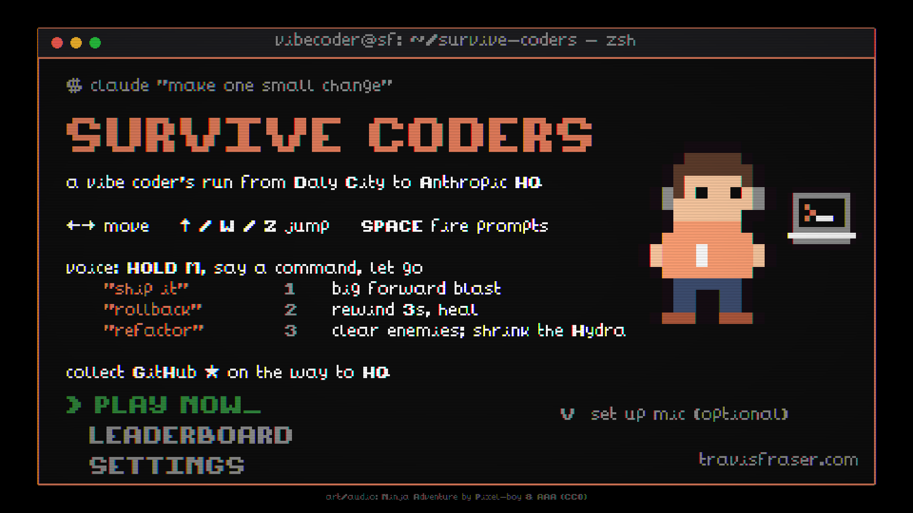

**2. The hook.** The robotaxi pulls up as `#demo-day` asks for one small change, then dark
mode (the first ping is shown).

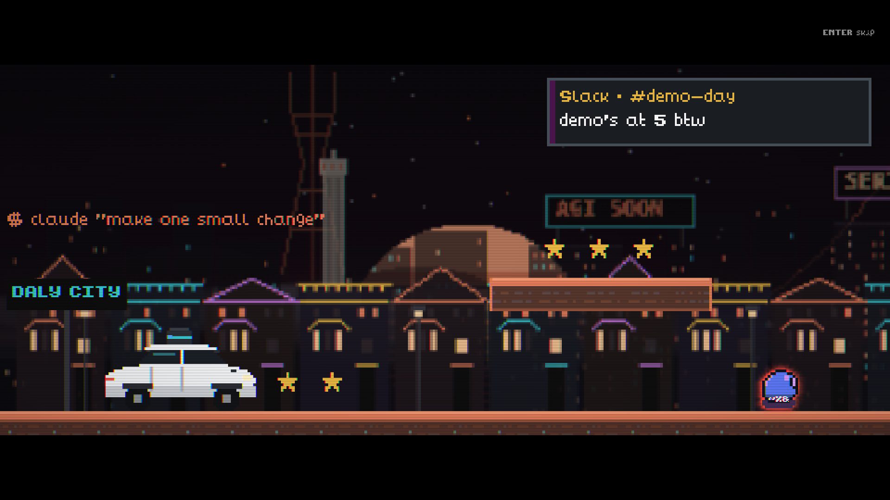

**3. The drop-off.** The car stops at the edge of its service area, roof lidar sweeping; Anthropic
HQ is 9.4 miles away. The intro hands over control after about 12 seconds; Enter, or a tap,
skips it.

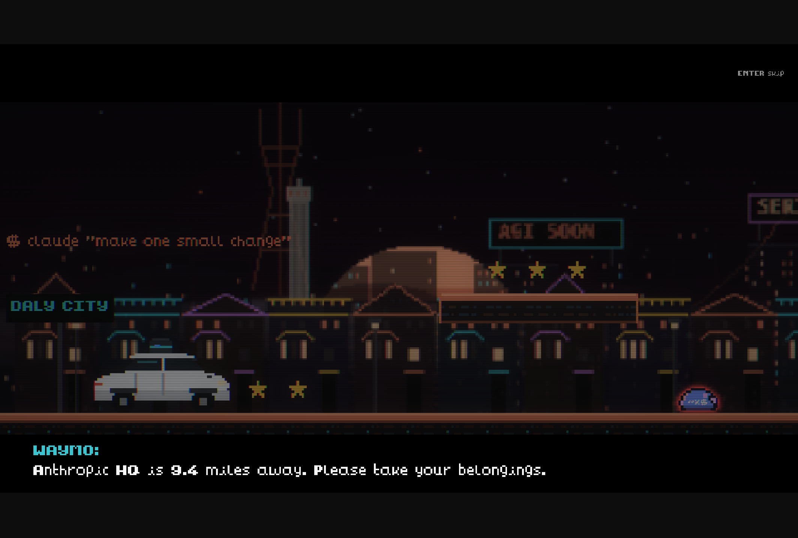

**4. Powers are taught at the moment of need.** When a cluster of Bad Prompt Blobs comes into
view, a tip explains `refactor` and the matching slot in the terminal bar flashes. `rollback`
is taught the first time you actually lose health, not at a fixed spot.

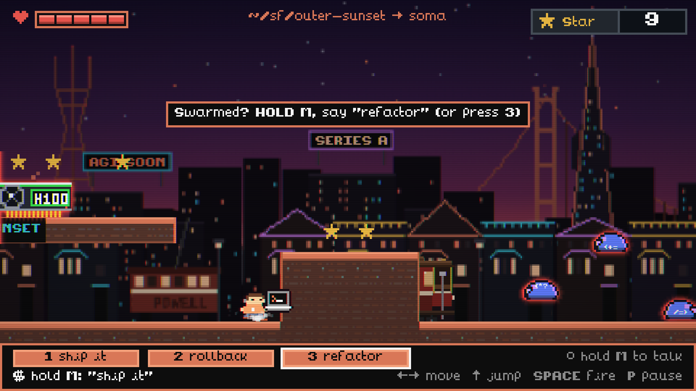

**5. Street combat.** Prompt bolts from the laptop against a Bad Prompt Blob, under the first
tip, with Sutro Tower, Coit Tower, and the Painted Ladies behind. The HUD shows the pixel health
bar, the GitHub star counter, and the neighborhood you are in as a path, which changes at each
street sign on the way to SoMa.

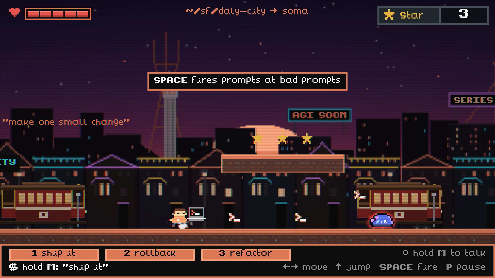

**6. MAX.** Past the second pit, the MAX chip turns held fire into a stream of characters, 25 a
second from a 160-token budget that the HUD counts down; an H100 has just run out of memory.

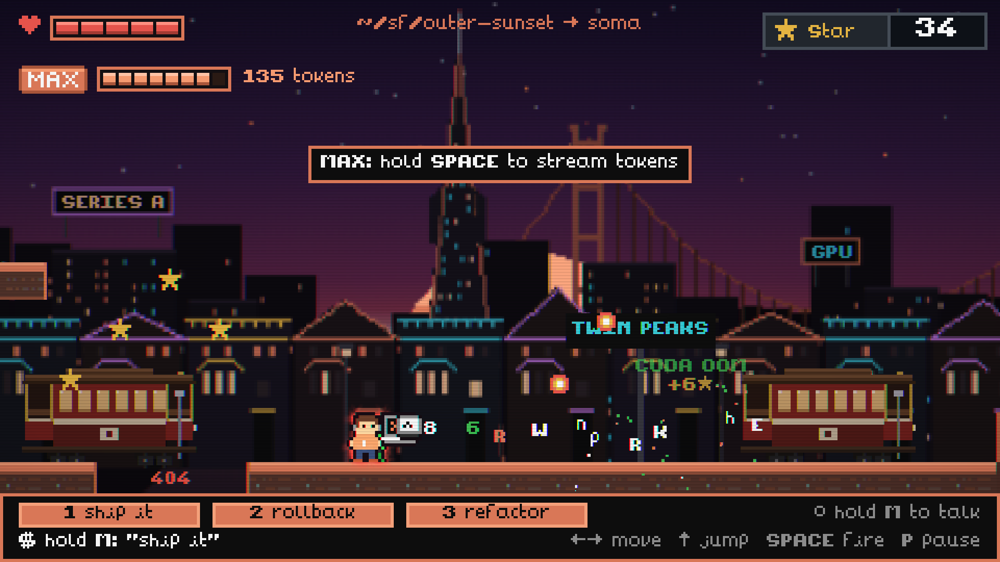

**7. The Powell St cable car.** A gap too wide to jump, over a pit that glows `404`; ride the
car's roof across and collect the star trail.

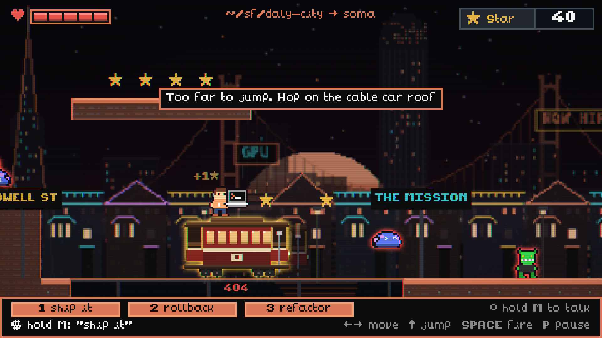

**8. The Transit Center.** The level ends at the Salesforce Transit Center: its undulating
perforated skin, the park's trees over the roof, and the gondola track climbing the side. Its
sliding doors part as you reach them and close behind you as you walk in.

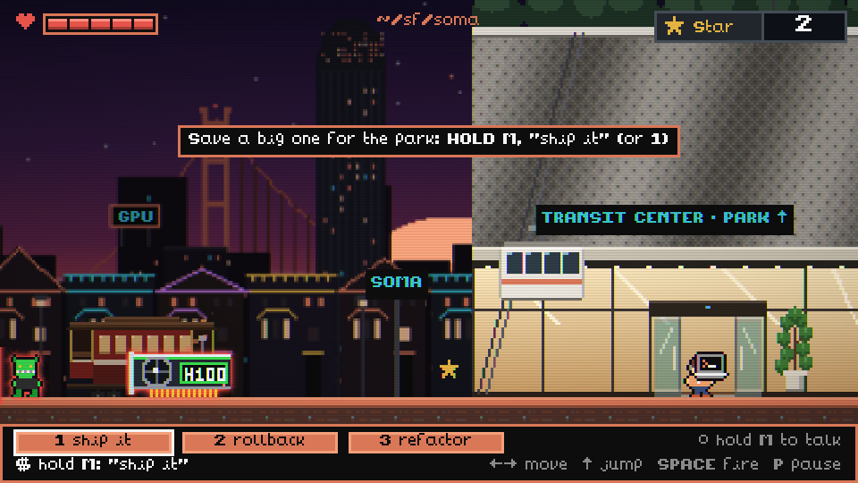

**Salesforce Park.** The gondola carries you up with a founder who has 90 seconds and a pitch.
The park teaches one new threat at a time. Founders throw pitch-deck slides and grab you for a
"quick demo" that you mash out of, and they leave follow-up emails behind. Vested bros are
untouchable until their 1-year cliff ticks over their heads. Zone 2 joggers shove you aside.
The bus fountains launch you over a wall. Then the amphitheater locks you in for demo day, with
judges scoring each founder you take out, until you get into YC (Your Coffee). The Salesforce
Tower's lobby waits at the end. Its three floors aren't built yet, so for now the lobby leads
straight to the Hydra.

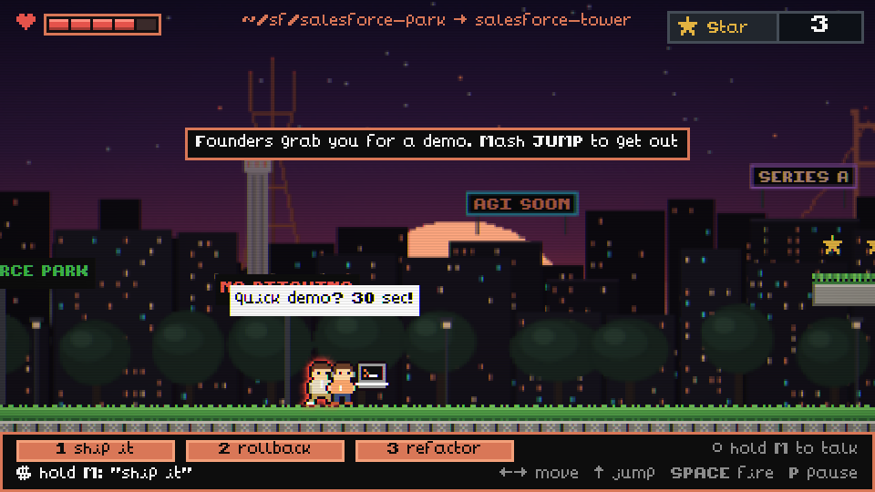

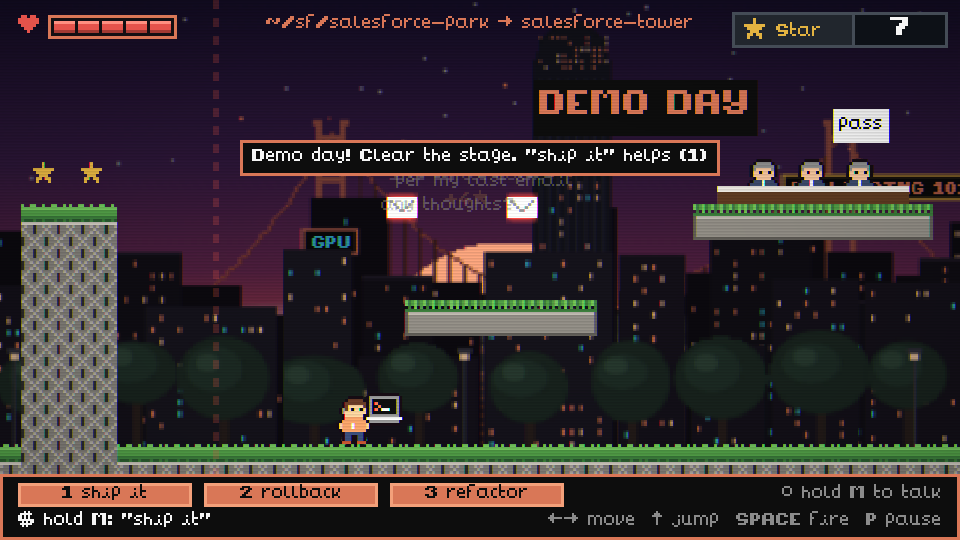

**9. The Context Rot Hydra.** Inside, the office goes quiet, the terminal types
`make one small change`, the heads answer, and the boss card lands. The body is a heap of H100s
with their fans spinning, and the necks are pipes streaming tokens up into the heads; every
growth turn drops another card on the heap. The HUD shows boss health and, separately, context
growth.

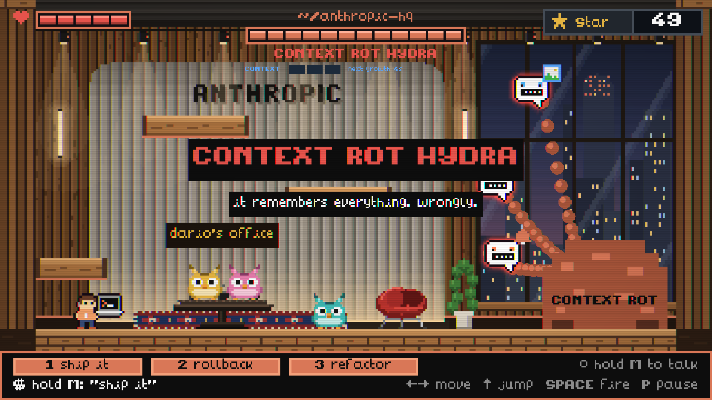

**10. A full context window.** Every attack has a 600 ms wind-up: the image-flood head flashes
and marks its drop lanes on the floor before the tiles fall, always leaving three adjacent lanes
clear. The heads here are fully grown, so the context overflows: terminal rain buries the office
and the platforms, and a lie sinks into the noise. Everything that can hurt you still draws above
the rain, the lane markers included, and the player keeps a small pool of clear sight. Context rot
deals damage every 3 seconds until you refactor; the meter reads OVERFLOW, the terminal bar's
status line turns red with the command, and slot 3 flashes. A notification skull hunts from the
Hydra's base.

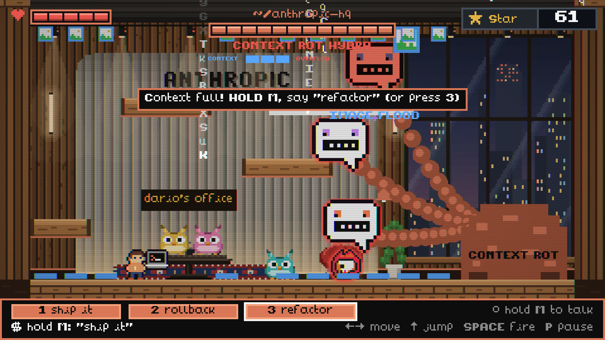

**11. The payoff.** The robotaxi comes back (HQ is inside its service area), `#demo-day` asks
for one more small change, and an original chiptune victory song plays.

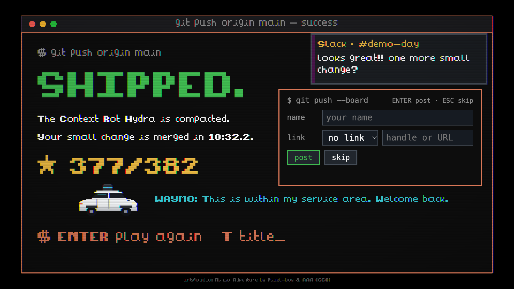

### On a phone

iPhone-size landscape (844x390) at 2x, in Chrome's device emulation.

**12. Touch title.** The same terminal, with touch instructions; a tap starts the run, and on
Android it goes fullscreen.

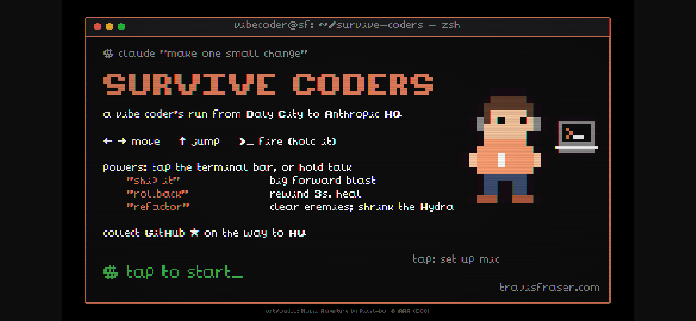

**13. Touch controls.** The D-pad and the fire (`>_`) and jump buttons sit at the screen's
corners, the outer ones in the letterbox bars rather than over the game; here right and fire
are held. Powers are taps on the terminal bar, beside a hold-to-talk slot, and the tips say tap.

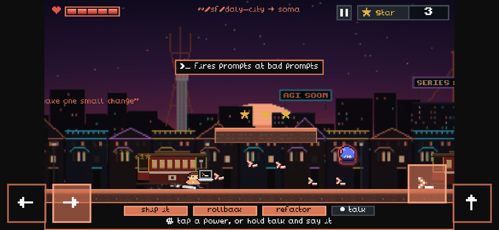

**14. The Hydra on a phone.** A jump-shot with fire and jump held together, a pause button
beside the star badge, and a head lying to you. The `<->` chip over the player means a gaslight
orb has just reversed the controls; it blinks out when they come back.

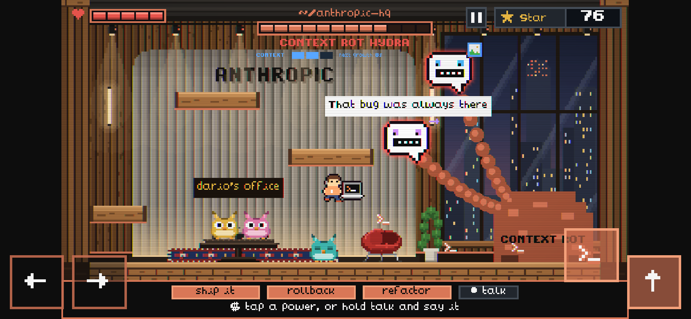

**15. Portrait.** Turned upright, the game pauses behind a prompt to turn the phone sideways.

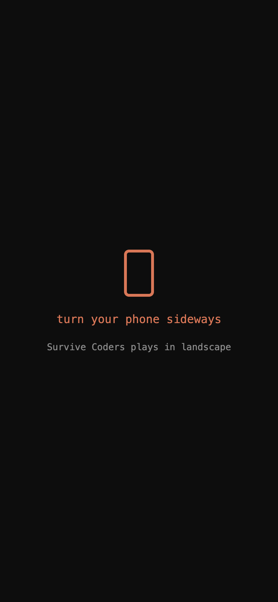

A dated design review with before and after screenshots is in
[`docs/review/design-review.md`](docs/review/design-review.md).

---

## Features

- A skippable, 12-second robotaxi intro cutscene with Slack `#demo-day` messages, and a matching payoff on the win screen
- One side-scrolling level from Daly City to SoMa, with the HUD path following the neighborhood signs, over a parallax San Francisco skyline (Sutro Tower, the Golden Gate Bridge, Coit Tower, the Transamerica Pyramid, the Salesforce Tower, the Painted Ladies, moving cable cars), ending at Anthropic HQ's glass tower, whose sliding doors let you into the lobby
- Three enemy types: the Bad Prompt Blob (splits in two), the Keyboard Goblin (charges and spits keycaps), and the H100 GPU (six hit points, vents arcing heat)
- A rideable Powell St cable car, star arcs over pits, and pits that glow `404`
- The Context Rot Hydra boss: a heap of H100s whose neck pipes stream tokens into three heads with distinct roles (image flood, gaslighting orb that reverses your controls, shown as a chip over the player, and a spawner whose notification skulls hunt you and respawn until that head dies); growth every 8 seconds, each turn dropping another GPU on the heap; once the context window is full, matrix rain buries the arena and context rot deals damage until you refactor, while threats and warnings stay drawn above the rain; lying speech bubbles, an enraged last head, and Furbies in the office worth bonus stars
- Push-to-talk voice powers (`ship it`, `rollback`, `refactor`) with keyboard and tap equivalents; the HUD shows what was heard separately from what actually fired, and when a power is cooling down
- A MAX power-up past the second pit: grab the chip and holding fire streams random characters at 25 a second from a 160-token budget, until the usage limit hits; unspent tokens carry into the Hydra fight
- Platformer feel: coyote time, a 120 ms jump buffer, half gravity at the jump apex, a faster fall, hit stop, squash and stretch, and camera lookahead
- Every piece of text rendered in an 8x8 pixel font; a CRT scanline post-effect
- Pause, mute, and a boss checkpoint that restores your star total on retry
- Plays on phones and tablets: a touch D-pad and fire and jump buttons at the screen's corners, powers you tap in the terminal bar, hold-to-talk, auto-pause when the phone turns portrait or the app goes to the background, and a home-screen install that runs fullscreen
- An original chiptune victory song on the win screen, written as MIDI note data and synthesized in the browser
- Link previews and a favicon drawn from the game's own pixels

## Controls

| Action | Keyboard | Touch |
|---|---|---|
| Move | Arrow keys or A / D | ← → bottom left; slide between them |
| Jump | Up, W, or Z | ↑ bottom right; hold for a higher jump |
| Fire prompts | Space, X, or J | `>_` next to jump; hold to keep firing |
| Stream tokens (after grabbing MAX) | Hold Space, X, or J | Hold `>_` |
| Voice power | Hold M, say the command, release | Hold *talk* in the terminal bar, say it, release |
| Powers without voice | 1 ship it, 2 rollback, 3 refactor | Tap the power in the terminal bar |
| Pause / mute | P or Esc / N | Pause button at the top; sound toggle on the pause screen |
| Title screen | Enter start, V set up microphone | Tap to start, tap *set up mic* |
| Intro | Enter, Space, or Esc skips | Tap skips |
| End screen | Enter retry (from the boss if you died there), T title | Tap retries; *title* button |

Touch controls appear on devices whose main pointer is a finger. A thumb on the seam between
`>_` and ↑ presses both. The game plays in landscape and pauses if the phone turns portrait.
On Android the tap that starts a run goes fullscreen; iPhone Safari cannot make a page
fullscreen, but *Add to Home Screen* runs the game fullscreen from its web manifest.

Five URL flags help when testing: `?park` and `?boss` start at Salesforce Park or the boss after
you press Enter on the title screen, `?debug` draws the physics bodies, `?fx=off` turns off the CRT effect, and `?touch` shows
the touch controls on a desktop (they work with a mouse).

---

## Technology stack and why

| Layer | Choice | Why |
|---|---|---|
| Engine | Phaser 3.90 with Arcade Physics | Tilemaps, cameras, animation, particles, and WebGL post-effects out of the box. Arcade rather than Matter physics because a platformer only needs axis-aligned boxes, and it keeps collisions predictable. |
| Build | Vite 8 | An instant dev server and a static `dist/` that any host serves unchanged. No React or Next.js because the game owns the whole canvas; a component framework would be weight with no payoff. |
| Language | Plain JavaScript modules | Speed during a timeboxed build; no compile step beyond Vite. |
| Art | Sprites and backgrounds drawn in code at boot, plus two sprite sheets from the Ninja Adventure pack | Code-drawn pixel art needs no asset pipeline and every texture is keyed, so pack art can replace a sprite without touching game logic. |
| Text | An 8x8 bitmap font (Ninja Adventure) parsed with Phaser's RetroFont, with proportional spacing measured from each glyph | Keeps every string pixel-art, including symbols the sheet lacks (drawn into unused cells). |
| Look | A custom CRT post-pipeline (scanlines, slight RGB split, vignette); no bloom, because Phaser's bloom halves the frame before adding glow | Ties mismatched art sources into one terminal aesthetic. |
| Voice | The browser's Web Speech API, push-to-talk | No API key, no server, and no cost; the browser handles recognition. Keyboard keys cover browsers without it. |
| Input | Phaser keyboard input; touch buttons as DOM elements over the canvas (pointer events) | The canvas is letterboxed at 16:9, so buttons anchored to the screen's corners sit partly in the side bars on wide phones instead of over the game. |
| Audio | Ninja Adventure sound effects, two music tracks converted to MP3, and a victory song synthesized with WebAudio | CC0 licensed; MP3 plays in every major browser. The song is MIDI note data on a small NES-style synth, so it ships as code, not a file. |
| Hosting | Vercel, static, Git-linked | Every push to `master` builds and deploys; no server code to run. |

---

## Architecture

```
┌─ Browser ───────────────────────────────────────────────────────────────┐
│  index.html → src/main.js   Phaser.Game 960x540, WebGL, CRT pipeline    │
│                                                                         │
│  Scenes: Boot → Title → Level1 ──→ Park ──→ BossHQ ──────→ End          │
│                          │ Cine overlay     │ Hydra                     │
│                          │ (intros)         │                           │
│                 HUD runs in parallel with every play scene              │
│                                                                         │
│  Art: drawn to canvas textures at boot (sprites.js, backdrops.js,       │
│       hqArt.js, parkArt.js) + public/assets (sheets, font, audio)       │
│  Storage: one localStorage key (a demo setting)                         │
│                                                                         │
│  src/touch.js ── DOM buttons over the canvas ──→ Player.tick, HUD taps  │
│  src/victorySong.js ── MIDI note data ──→ WebAudio synth (win screen)   │
│  src/voice.js ── hold M ──→ Web Speech API                              │
└──────────────────────────────┼──────────────────────────────────────────┘
          trust boundary: in Chrome, microphone audio is sent to the
          browser vendor's speech service for recognition
                               ▼
                    browser speech recognition service

Vercel: serves the static dist/ build; there is no backend.
```

### The design decision worth explaining

Voice is the game's hook, and a live demo is the worst environment for it: the presenter is
talking the whole time, the room is loud, and conference wifi drops. So voice is push-to-talk
and fires on release. While M is held, `src/voice.js` collects the transcript; on release it
fires the earliest recognized command in that hold, or nothing if none was said. If the
command only arrives in the final recognition result, it fires when the session ends. Every
power also has a key (1, 2, 3), so a failed microphone or an unsupported browser never blocks
play. This was verified with a simulated recognizer: a command fires on release, a late final
result still fires, ordinary chatter fires nothing, and when two commands are spoken the first
one wins.

What the design does not claim: recognition accuracy, offline use, or that audio stays on the
device. Chrome's recognition runs on the browser vendor's servers.

Not in this project: backend, database, authentication, environment variables, secrets.

---

## Local setup

Requires Node.js `^20.19.0` or `>=22.12.0` (Vite 8's floor) and npm. The repository is public.

```bash
git clone https://github.com/travisstephenfraser/survive-coders.git
cd survive-coders
npm ci
npm run dev        # Vite prints the local URL (default http://localhost:5173)
```

Other scripts: `npm run build` writes the static site to `dist/`, `npm run preview` serves
that build locally, and `npm run images` redraws the favicon, home-screen icons, and link-preview
card in `public/` from the game's sprites (`scripts/make-images.mjs`, no dependencies). The microphone only works in a secure context, so use `localhost` (not a
LAN IP over plain HTTP) when testing voice.

---

## Tests

There is no automated test suite yet; `package.json` has no test script, and there are no test
files. The production build is the only command-line check:

```console
$ npm run build
dist/index.html                    2.22 kB │ gzip:   0.96 kB
dist/assets/index-BPN3vGc9.js  1,299.00 kB │ gzip: 355.54 kB
✓ built in 334ms
```

That output is from a fresh clone of `5f16806` into a clean directory (`npm ci` then
`npm run build`); Vite's large-chunk warning is trimmed.

Gameplay was verified with scripted browser runs that drive keyboard, touch, and pointer events
against the running game, recorded with screenshots in
[`docs/review/design-review.md`](docs/review/design-review.md). These are not in CI:

| Check | Result |
|---|---|
| Jump tuned from a height and rise time | 70 px apex, 0.8 s airtime (was 0.94 s); a jump pressed just before landing fires |
| Repeat runs reach HQ without reloading | 3 of 3 back-to-back runs walk in through the HQ doors |
| HQ doors | They open within 40 px of the player and close when the player backs off; crossing in mid-air still walks the player in from the doorstep; a rollback pressed during the walk-in is ignored |
| Winning while taking damage | Exactly one outcome: the final head dies with the player at 1 HP against the boss, and the game ends in victory |
| Three consecutive boss retries | One music track, one voice listener, one pause listener each time; stars restored to the checkpoint |
| Flood warnings are honest | Tiles land exactly on the marked lanes, leaving a clear gap |
| Overflow stays readable (2026-09-27) | At full rain, the flood lane markers, hazards, heads, and the player draw above it; context rot still ticks at 3, 6, and 9 s after the overflow starts; refactor clears it and the terminal bar's normal hint returns |
| Intro length and skip (2026-09-27) | Control returns at 11.9 s (was 18.2 s); a skip partway through leaves the player visible with physics on, the HUD shown, and no intro events pending |
| Rollback tip on real damage (2026-09-27) | Shown after the first hit that lands, waiting out any other tip; not in god mode, not once rollback has been used, and reset by a new run |
| Context meter is truthful | The HUD countdown matches the real growth timer, including after `refactor` |
| Push-to-talk parsing | The four cases in [Architecture](#the-design-decision-worth-explaining) pass with a simulated recognizer |
| Production build | Loads with no failed requests and no console errors or warnings, locally and on the live URL |
| Touch controls (iPhone landscape emulation, synthetic touch and pointer events) | The D-pad moves at full speed and slides between directions; a tapped jump peaks at 24 px and a held one at 70 px; holding jump jumps once, as the keyboard does; each power fires from its slot; pause, resume, the sound toggle, and auto-pause on a hidden tab or a portrait turn all work |
| Touch-only playthrough | A scripted run using only the touch controls finished Level 1, cable car included, and the Hydra; it checks the controls, not the difficulty |
| Canvas refits after rotation | Landscape, portrait, landscape: back to 693x390 within 300 ms; Phaser alone stayed fitted to the portrait size |
| Victory song | Offline render at -27.4 dB RMS against -27.9 dB for the level music; silent within 0.8 s of leaving the win screen |

Not verified by automation: real spoken commands through a microphone, the audio mix, and
difficulty with first-time players.

---

## Deployment

1. Push to `master`. The Vercel Git integration runs `vite build` and serves `dist/` at
   <https://survive-coders.vercel.app>. The first push after linking started a production
   build within seconds and was live about half a minute later.
2. To deploy without pushing, run `vercel deploy --prod --yes` from the repo root with the
   Vercel CLI installed and logged in.
3. Verify with `curl -sI https://survive-coders.vercel.app/ | head -1` (expect `HTTP/2 200`),
   then open the URL in Chrome, press V on the title screen, hold M, and say *ship it*.

**Link previews** (Slack, iMessage, X, LinkedIn) come from the Open Graph tags in
`index.html`, not from a Vercel setting; they point at `public/og.png` by absolute URL because
crawlers do not run JavaScript. Apps cache a preview once fetched: LinkedIn's Post Inspector
refetches on demand, and elsewhere a new query string (`?v=2`) forces a fresh one.

**The step that is easy to miss.** Share the production alias, not the per-deployment URL
Vercel prints: per-deployment URLs sit behind Vercel's deployment protection and redirect to a
login. Also, `.vercelignore` keeps `feed/` (local, gitignored raw asset packs) and `docs/`
(review screenshots) out of uploads; remove those lines only if you mean to publish them.

---

## Known limitations and what I would do next

- **Voice needs Chrome or Edge and a network connection**, and Chrome sends the audio to its
  speech service. Next: on-device recognition in the browser, so voice works offline and
  audio never leaves the machine.
- **No automated tests.** The checks above are scripted browser runs. Next: unit tests for
  the command parsing in `src/voice.js` and a headless smoke test (title, level, boss, win) in CI.
- **Two levels and one boss.** Next: the three Salesforce Tower floors (CRM agents that lock
  you into contracts, chatbot popups) and a free-fall where you type `build me a parachute`,
  then more neighborhoods and the two unused enemies from the original monster sheet (a Pixel
  Nudger that moves platforms and a Breach Wraith that leaks keys).
- **No reduced-effects option.** The CRT effect, camera flashes, and screen shake cannot be
  turned off, which matters for photosensitive players and projectors. Next: a toggle on
  the title screen.
- **One mute for everything.** Next: separate music and sound-effect volumes.
- **Touch is verified in emulation only.** Level 1 and the Hydra were finished touch-only in
  Chrome's iPhone emulation, driven by synthetic touch and pointer events; nobody has played it
  on a real phone yet. iPhone Safari keeps its toolbar unless the game is added to the home
  screen. Next: a real-device pass on iOS Safari and Android Chrome.
- **Two platforming rough edges.** Clipping a platform corner on the way up stops the jump
  dead, and platforms are solid from below. Next: corner correction and one-way platforms.
- **A 1.3 MB JavaScript bundle**, mostly Phaser, triggers Vite's chunk-size warning. It loads
  once and is cached. Next: split Phaser into its own vendor chunk.
- **No sign-in or leaderboard.** Stars reset each session; accounts and a shared leaderboard were
  deferred past the demo.

---

## License and credits

Licensed under the [Apache License 2.0](LICENSE). Copyright 2026 Travis Fraser. The license
covers this repository's code, art, and music; the third-party assets below keep their CC0
dedication.

Third-party assets: the slime and skull sprite sheets, the 8x8 font, the sound effects, and both
music tracks come from the [Ninja Adventure Asset Pack](https://pixel-boy.itch.io/ninja-adventure-asset-pack)
by Pixel-boy and AAA, released under CC0. All other art is drawn in code in this repository, and the victory song is original, written as
note data in `src/victorySong.js`.

This is an unofficial hackathon project. It is not affiliated with or endorsed by Anthropic,
Waymo, NVIDIA, Slack, or GitHub; their names are used descriptively.

## Contributing

Not accepting outside contributions.
