# Survive Coders

**A 16-bit platformer where a vibe coder fights vibe-coding failure modes across San Francisco, armed with a floating laptop and their voice.**

Survive Coders is a browser game built for a hackathon demo. A robotaxi drops the player at the
edge of its service area in Daly City with one request from `#demo-day`: *make one small
change before the demo.* The run crosses the city to Anthropic HQ, fighting enemies drawn from
real vibe-coding pain (Bad Prompt Blobs, Keyboard Goblins, overheating H100 GPUs) and ends
against the Context Rot Hydra, a three-headed boss whose chat-bubble heads grow every turn and
lie to you. The idea that shaped it is that your voice is a weapon: hold **M**, say *ship it*,
*rollback*, or *refactor*, and the power fires when you let go. Speech is never required;
every voice power has a keyboard key and a tap target on phones, and ordinary talking during a
demo fires nothing, because `src/voice.js` only acts on release and only on a recognized
command. It plays with a keyboard or, on phones and tablets, with touch controls.

Status: hackathon demo: the city, Salesforce Park, three floors of the Salesforce Tower, the fall
from its top, and one boss, plus an online leaderboard (fastest finish, or most stars) and a
settings screen. Built with Claude Code (Claude Opus 5.5) as a pair programmer; commits carry
`Co-Authored-By` trailers.

**Live app: <https://survive-coders.vercel.app>**

```
Frontend   Phaser 3.90 + Vite 8, plain JavaScript, WebGL + CRT post-FX   Vercel
Backend    One Vercel function (api/scores.js) on Neon Postgres: the leaderboard
Input      Keyboard; touch on phones and tablets (DOM buttons over the canvas)
Voice      Web Speech API in the browser (Chrome or Edge), keys 1/2/3 or taps as fallback
Tests      83 unit tests (npm test, the API on PGlite); scripted browser checks in docs/review/
```

Live URL checked 2026-09-27: HTTP 200.

---

## Contents

- [Product walkthrough](#product-walkthrough)
- [Features](#features)
- [Controls](#controls)
- [Technology stack and why](#technology-stack-and-why)
- [Architecture](#architecture)
- [Local setup](#local-setup)
- [Tests](#tests)
- [Deployment](#deployment)
- [Known limitations and what I would do next](#known-limitations-and-what-i-would-do-next)
- [License and credits](#license-and-credits)
- [Contributing](#contributing)

---

## Product walkthrough

Desktop, 960x540 at 2x. Every frame is the running game, staged by script and frozen on the
frame shown.

**1. Title screen.** A terminal window with the controls, the vibe coder as key art, `V` to set
up the microphone, and a menu: PLAY NOW, LEADERBOARD, SETTINGS.


Settings holds music and sound-effect volume, sound on or off, the CRT filter, screen shake,
flashes, fullscreen, and a run timer, all saved in the browser. The leaderboard has two tabs:
TIME (the one that opens) ranks finished runs by the fastest finish, more stars breaking a tie;
STARS ranks them by the most stars, the faster run breaking a tie. Each of the top ten can link
a profile (shown here with sample entries).

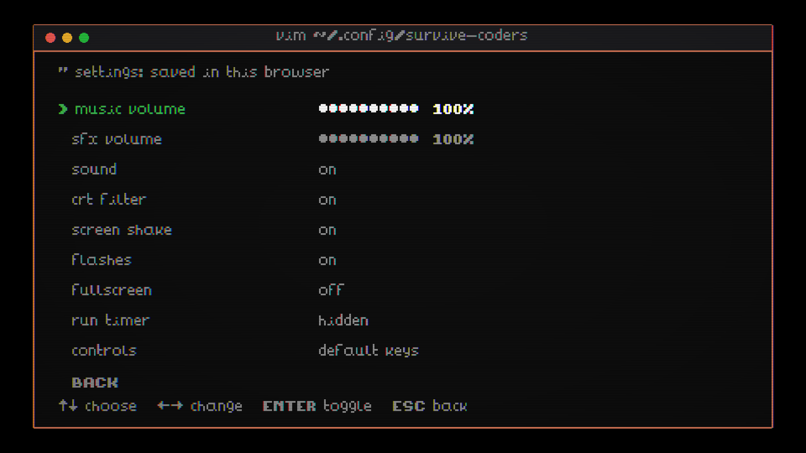

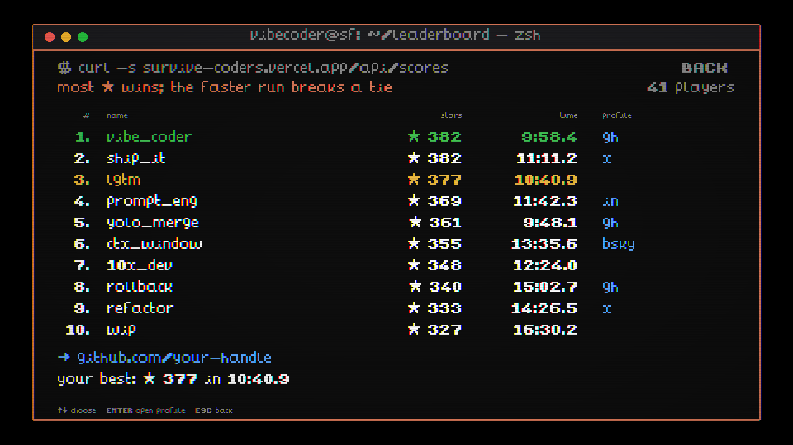

**2. The hook.** The robotaxi pulls up as `#demo-day` asks for one small change, then dark
mode (the first ping is shown).


**3. The drop-off.** The car stops at the edge of its service area, roof lidar sweeping; Anthropic
HQ is 9.4 miles away. The intro hands over control after about 17 seconds, each line up long enough to read; Enter, or a tap,
skips it.


**4. Powers are taught at the moment of need.** When a cluster of Bad Prompt Blobs comes into
view, a tip explains `refactor` and the matching slot in the terminal bar flashes. `rollback`
is taught the first time you actually lose health, not at a fixed spot. The first two tips, fire and
`refactor`, stay up until you do the thing.


**5. Street combat.** Prompt bolts from the laptop against a Bad Prompt Blob, under the first
tip, with Sutro Tower, Coit Tower, and the Painted Ladies behind. The HUD shows the pixel health
bar, the GitHub star counter, and the neighborhood you are in as a path, which changes at each
street sign on the way to SoMa.


**6. MAX.** Past the second pit, the MAX chip turns held fire into a stream of characters, 25 a
second from a 160-token budget that the HUD counts down; an H100 has just run out of memory.


**7. The Powell St cable car.** A gap too wide to jump, over a pit that glows `404`; ride the
car's roof across and collect the star trail.


**8. The Transit Center.** The level ends at the Salesforce Transit Center, drawn from
photos: a pearl-white skin punched in five-fold rosettes like the building's Penrose
perforations, its hem arching over the entrance on white struts, the park's trees over the
roof, and the gondola's cable climbing the side, with the Salesforce Tower rising behind it.
Its sliding doors part as you reach them and close behind you as you walk in.


**Salesforce Park.** The gondola carries you up from Mission and Fremont with a founder who has
90 seconds and a pitch. The level follows the real park's map, walking west from the gondola:
the Oculus on its glass floor, the Main Plaza and its cafe, the children's play area, picnics
on the Central Lawn, the bus fountain, and the amphitheater at the far end. It teaches one new
threat at a time. Founders throw pitch-deck slides and grab you for a "quick demo" that you
mash out of, and they leave follow-up emails behind. Vested bros are untouchable until their
1-year cliff ticks over their heads. Zone 2 joggers shove you aside. Buses driving through the
terminal underneath set off the fountain's geysers in a wave, and one launches you over a
wall. Then the amphitheater locks you in for demo day, with judges scoring each founder you
take out, until you get into YC (Your Coffee). The Salesforce Tower's lobby waits at the end,
the one liberty taken with the map (the real tower stands mid-park).


**Salesforce Tower.** Three floors, each a checkpoint. Floor 59 is the SDR bullpen: CRM agents
hold a sales distance and throw contracts that don't hurt but lock you in, so you can't fire
until the contract lapses or `refactor` voids it (it *auto-renews annually*), and a gong rings
on every signing. The elevator up is a six-second ride with an account executive who pitches
over the building's bossa nova until the ding cuts him off mid-sentence, and the next ride
picks the song up where it left off. Floor 60 is the Dreamfarce demo center, where
chatbots hover beside you and open popups you have to shoot closed, each followed by *Was this
helpful?* Floor 61 is the Ohana Floor, after the real one: living green columns, blue sofas,
glass to the ceiling over the bay. Two waves come for you, but the way out doesn't wait on
them: reach the glass, or clear the lounge, and the whole sales team drops through the ceiling
right behind you, unhurtable and flexible on pricing. They crowd you toward the window and lob
contracts that lock you in and pile up at your feet. The ones that sail over your head hit the
glass: two leave webs of cracks, the third goes through, and that's the only way out.

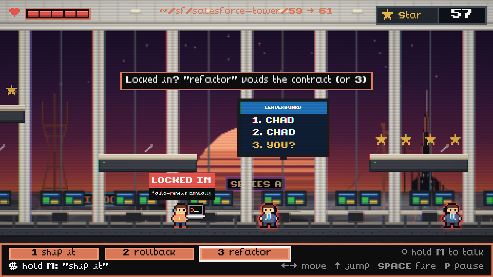

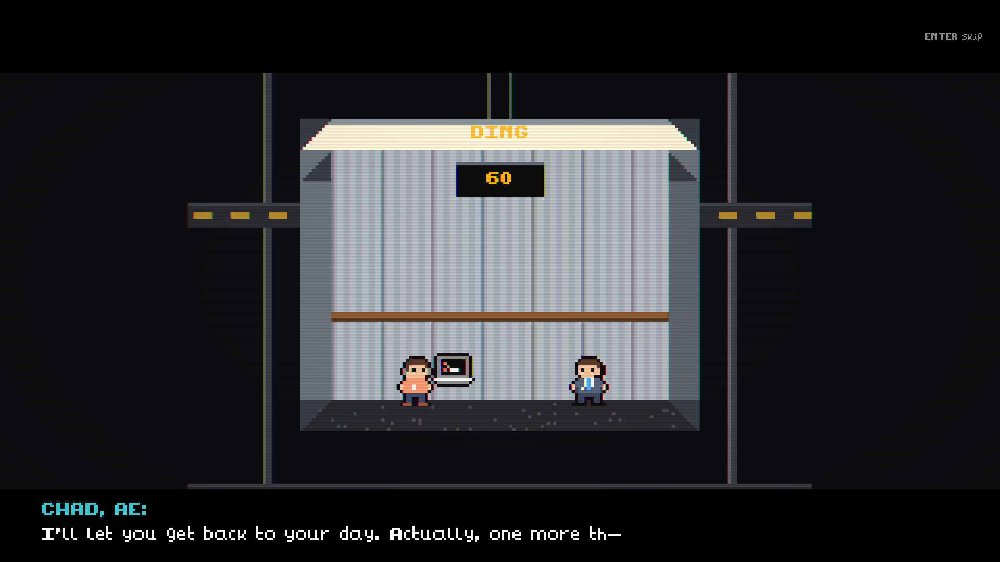

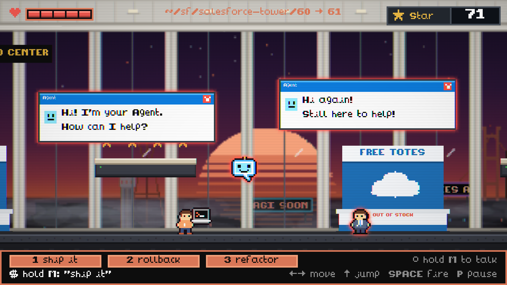

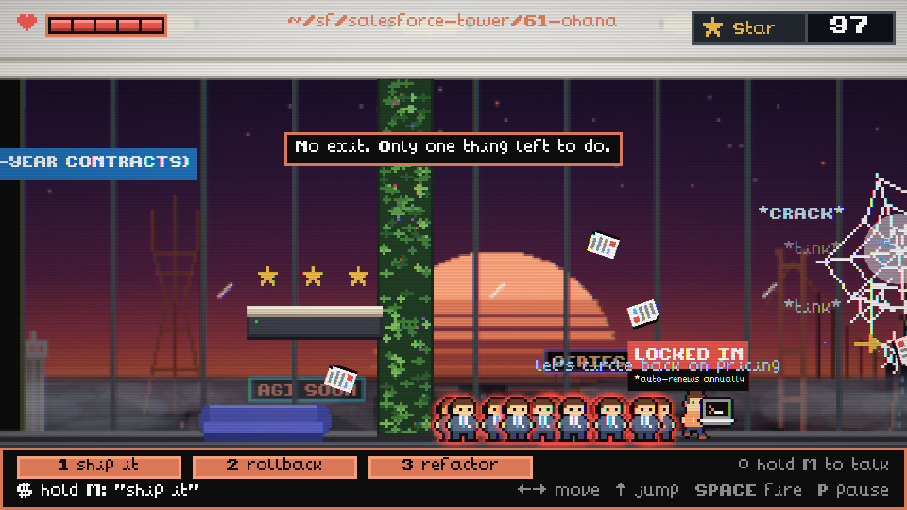

**The fall.** Out through the glass, you tumble down the Salesforce Tower's face, past the lit
lattice of its crown, the braced floors under it and the Ohana Floor's broken pane, while an
altimeter counts down from 1,070 feet in 24 seconds. The laptop tumbling beside you runs Claude
Code, and the way down alive is three lines typed into it. `build me a parachute` gets a CRM
dashboard in the shape of a canopy, charting your altitude as it trends down. `no, a real one`
gets Parachute Pro, strapped to your back behind a paywall at $150 a seat a month, Enterprise
tier only. `ship it` deploys it anyway: the paywall shatters, the canopy opens, and the fall's
song drops into the ride's. Case, spacing and small typos don't matter, Tab fills in the line (*that's vibe coding*),
and typing never fires a power. On a phone every tap types the next letter, or you hold *talk*
and say the line. Run out of altitude and you meet the Transit Center's roof, `404: parachute
not found`, and a retry restarts the fall.

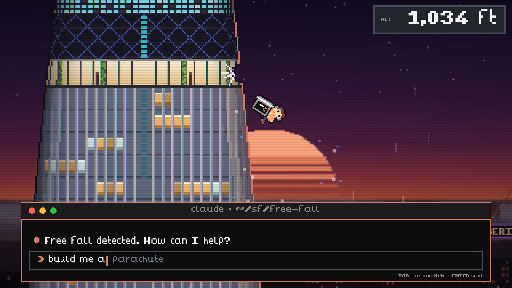

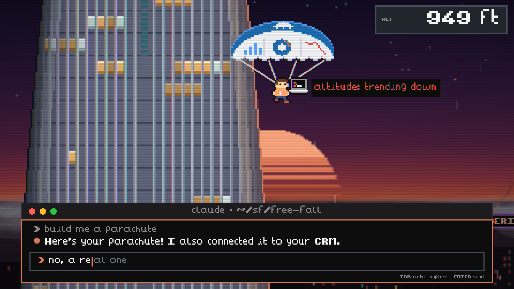

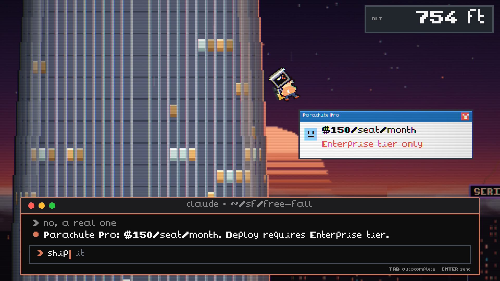

**The landing.** The canopy carries you east over SoMa's rooftops, the Salesforce Tower lit up
behind you. Steer through three arcs of stars, each laid on a line the canopy can actually fly,
and come down on a Waymo that has lined up under you: *Rider detected on roof. Adjusting route.*
Its lidar sweeps you, you sink through the roof as pixels, and there you are in the back seat as
it drives off. Miss the roof and it pulls up beside you on the street, for the same trick.

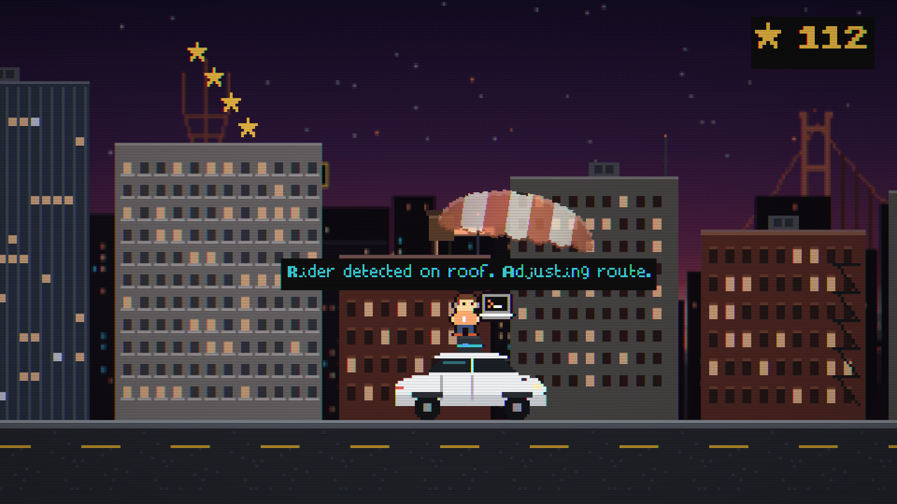

**The ride.** From the back seat, both front seats are empty and the wheel turns itself through
the bends while SoMa streams past the windshield. The screen between the seats wants you to press
*START RIDE*, then time-lapses the ETA from 47 minutes to 1, playing the elevator's bossa nova
(its skip button changes the title, not the song), while Slack asks whether the one line can do
dark mode, whether the office AI forgetting things is your change, and then moves the demo up.
The Waymo drops you at Anthropic HQ, *Rate your ride: ★★★★★?*, and you walk in through its
sliding doors.

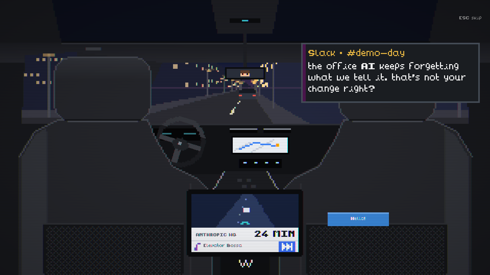

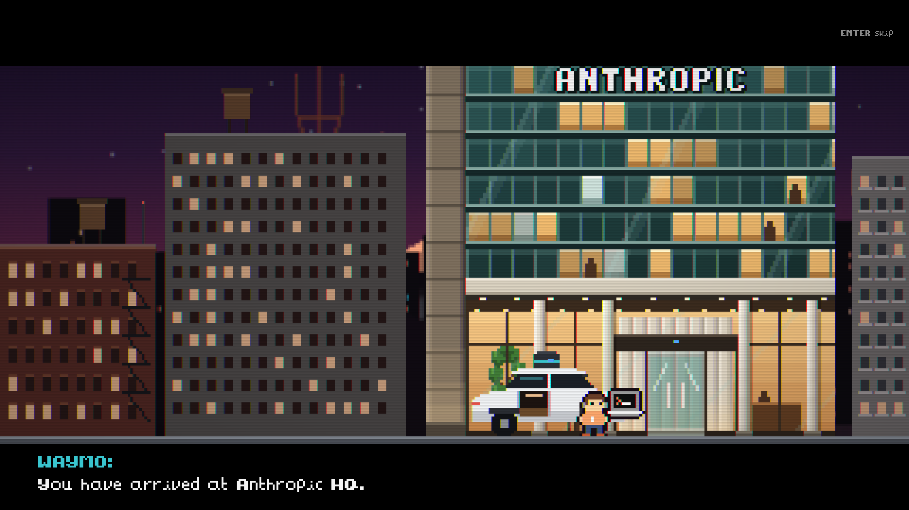

**9. The Context Rot Hydra.** Inside, the office goes quiet, the terminal types
`make one small change`, the heads answer, and the boss card lands. Your controls come back when
the card clears. The image-flood head fights alone at first; gaslight wakes 5 seconds in and the
notification head at 10, bringing both its skulls. A sleeping head shrugs off shots, and the
context keeps growing on its own clock. The body is a heap of H100s
with their fans spinning, and the necks are pipes streaming tokens up into the heads; every
growth turn drops another card on the heap. The HUD shows boss health and, separately, context
growth.


**10. A full context window.** Every attack has a 600 ms wind-up: the image-flood head flashes
and marks its drop lanes on the floor before the tiles fall, always leaving three adjacent lanes
clear. The heads here are fully grown, so the context overflows: terminal rain buries the office
and the platforms, and a lie sinks into the noise. Everything that can hurt you still draws above
the rain, the lane markers included, and the player keeps a small pool of clear sight. Context rot
deals damage every 3 seconds until you refactor; the meter reads OVERFLOW, the terminal bar's
status line turns red with the command, and slot 3 flashes. A notification skull hunts from the
Hydra's base.


**11. The payoff.** The robotaxi comes back (HQ is inside its service area), `#demo-day` asks
for one more small change, and an original chiptune victory song plays. The run's stars and
time are on the screen, and a ranked run can post to the leaderboard from here.


### On a phone

iPhone-size landscape (844x390) at 2x, in Chrome's device emulation.

**12. Touch title.** The same terminal, with touch instructions; a tap on PLAY NOW starts the
run, and on Android it goes fullscreen.


**13. Touch controls.** The D-pad and the fire (`>_`) and jump buttons sit at the screen's
corners, the outer ones in the letterbox bars rather than over the game; here right and fire
are held. Powers are taps on the terminal bar, beside a hold-to-talk slot, and the tips say tap.


**14. The Hydra on a phone.** A jump-shot with fire and jump held together, a pause button
beside the star badge, and a head lying to you. The `<->` chip over the player means a gaslight
orb has just reversed the controls; it blinks out when they come back.


**15. Portrait.** Turned upright, the game pauses behind a prompt to turn the phone sideways.


A dated design review with before and after screenshots is in
[`docs/review/design-review.md`](docs/review/design-review.md).

---

## Features

- A skippable, 17-second robotaxi intro cutscene with Slack `#demo-day` messages, and a matching payoff on the win screen
- A side-scrolling run from Daly City to SoMa, with the HUD path following the neighborhood signs, over a parallax San Francisco skyline (Sutro Tower, the Golden Gate Bridge, Coit Tower, the Transamerica Pyramid, the Salesforce Tower, the Painted Ladies, moving cable cars), ending at the Salesforce Transit Center
- Salesforce Park on the Transit Center's roof, laid out like the real one, with the bus fountain's geysers, a gondola intro, and a demo-day arena
- Three floors of the Salesforce Tower, joined by elevator rides, ending when the whole sales team drops in on the Ohana Floor and their contracts crack the window you leap through
- A free fall down the tower's face against an altimeter, where you type three lines into Claude Code for a parachute (it gets it wrong twice), then a canopy ride over SoMa through arcs of stars onto a Waymo's roof, and the ride to HQ from its back seat: empty front seats, a wheel that turns itself, a rider screen to press, and Slack while a 47-minute ETA time-lapses away
- Enemies by district: the Bad Prompt Blob (splits in two), the Keyboard Goblin (charges and spits keycaps), and the H100 GPU (six hit points, hops with heat and vents arcing steam) in the city; founders, vested bros, and Zone 2 joggers in the park; CRM agents (contracts that lock your fire) and chatbots (popups you shoot closed) in the tower
- A rideable Powell St cable car, star arcs over pits, and pits that glow `404`
- The Context Rot Hydra boss: a heap of H100s whose neck pipes stream tokens into three heads with distinct roles (image flood, gaslighting orb that reverses your controls, shown as a chip over the player, and a spawner whose notification skulls hunt you and respawn until that head dies, worth no stars so stalling can't farm them); the heads wake one at a time; growth every 8 seconds, each turn dropping another GPU on the heap; once the context window is full, matrix rain buries the arena and context rot deals damage until you refactor, while threats and warnings stay drawn above the rain; lying speech bubbles, an enraged last head, and Furbies in the office worth bonus stars
- Push-to-talk voice powers (`ship it`, `rollback`, `refactor`) with keyboard and tap equivalents; the HUD shows what was heard separately from what actually fired, and when a power is cooling down
- A MAX power-up past the second pit: grab the chip and holding fire streams random characters at 25 a second from a 160-token budget, until the usage limit hits; unspent tokens carry into the Hydra fight
- Platformer feel: coyote time, a 120 ms jump buffer, half gravity at the jump apex, a faster fall, hit stop, squash and stretch, camera lookahead, and a camera that holds its height in the street levels
- Every piece of text rendered in an 8x8 pixel font; a CRT scanline post-effect
- Pause (with a restart for the level you are on), mute, and a checkpoint at every level after the first (the park, each tower floor, the fall, the boss) that restores your star total on retry
- A title menu (PLAY NOW, LEADERBOARD, SETTINGS) driven by the arrow keys, a click, or a tap
- Settings: music and sound-effect volume, sound on or off, the CRT filter, screen shake, flashes (shake and flashes start off when the system asks for reduced motion), fullscreen where the browser has it, and a run timer in the HUD; saved in the browser
- An online leaderboard with two tabs. TIME: the fastest finish first, timed from the start of the run to the Hydra's fall, pauses and hidden tabs included (the game's timers don't all stop for a pause, so a clock that did could be cut short by pausing), with more stars breaking a tie. STARS: the most stars first (382 is the most one run can earn), with the faster run breaking a tie. Each board shows each player's best run for it, so a fast run and a thorough one can both count. Deaths and restarts cost time; going back to the first level starts a new run. A finished run posts a name and, optionally, a GitHub, LinkedIn, X, or Bluesky handle, which each of the top ten links to
- Plays on phones and tablets: a touch D-pad and fire and jump buttons at the screen's corners, powers you tap in the terminal bar, hold-to-talk, auto-pause when the phone turns portrait or the app goes to the background, and a home-screen install that runs fullscreen
- A song for each stretch of the run (the city, the park, the tower, the fall, the ride to HQ, and the Hydra), the new ones loudness-matched to the city's so none jumps out, plus two originals written as MIDI note data and synthesized in the browser: the elevator's bossa nova and the chiptune victory song on the win screen
- Share any run from the win or death screen: on a phone, the share sheet gets a card of the run (drawn in the game's own pixels) and a line with its link; on a desktop, S or a button copies the line and another saves the card. The link unfurls into the same card, and opens the game with a challenge on the title screen
- Link previews and a favicon drawn from the game's own pixels

## Controls

| Action | Keyboard | Touch |
|---|---|---|
| Move | Arrow keys or A / D | ← → bottom left; slide between them |
| Jump | Up, W, or Z | ↑ bottom right; hold for a higher jump |
| Fire prompts | Space, X, or J | `>_` next to jump; hold to keep firing |
| Stream tokens (after grabbing MAX) | Hold Space, X, or J | Hold `>_` |
| Voice power | Hold M, say the command, release | Hold *talk* in the terminal bar, say it, release |
| Powers without voice | 1 ship it, 2 rollback, 3 refactor | Tap the power in the terminal bar |
| Type a line (the fall) | Type it; Tab fills it in, Enter sends, Backspace fixes | Every tap types the next letter; or hold *talk*, say it, release |
| Steer the canopy | Arrow keys or A / D | ← → bottom left |
| Pause / mute / restart | P or Esc / N / R (while paused) restarts the level; the pause screen lists the controls and powers | Pause button at the top; *sound* and *restart level* on the pause screen, with the controls and powers |
| Title screen | ↑ ↓ or W / S choose, Enter picks; V sets up the microphone | Tap PLAY NOW, LEADERBOARD, or SETTINGS; tap *set up mic* |
| Settings | ↑ ↓ choose, ← → change, Enter toggles, Esc back | Tap a setting to change it; tap the volume dots to set a level |
| Leaderboard | ← → switch between TIME and STARS, ↑ ↓ choose, Enter opens the selected profile, Esc back | Tap TIME or STARS; tap a name to see its link, tap again to open it |
| Intro | Enter, Space, or Esc skips | Tap skips |
| End screen | Enter retry (from the park, the floor, the fall, or the boss you died on), T title | Tap retries; *title* button |
| Posting a win | Type a name and an optional handle or profile URL; Enter posts, Esc skips; then Enter plays again | The same form, with the phone's keyboard; tap the prompt to play again |

Touch controls appear on devices whose main pointer is a finger. A thumb on the seam between
`>_` and ↑ presses both. The game plays in landscape and pauses if the phone turns portrait.
On Android the tap that starts a run goes fullscreen; iPhone Safari cannot make a page
fullscreen, but *Add to Home Screen* runs the game fullscreen from its web manifest.

Nine URL flags help when testing: `?park`, `?tower=59` (or `60`, `61`), `?chute`, `?landing`,
`?ride`, and `?boss` start at Salesforce Park, a tower floor, the fall, the canopy, the ride to
HQ, or the boss after you pick PLAY NOW (a run started this way never goes on the leaderboard), `?debug` draws the physics bodies, `?fx=off` turns off the CRT effect, and `?touch` shows
the touch controls on a desktop (they work with a mouse).

---

## Technology stack and why

| Layer | Choice | Why |
|---|---|---|
| Engine | Phaser 3.90 with Arcade Physics | Tilemaps, cameras, animation, particles, and WebGL post-effects out of the box. Arcade rather than Matter physics because a platformer only needs axis-aligned boxes, and it keeps collisions predictable. |
| Build | Vite 8 | An instant dev server and a static `dist/` that any host serves unchanged. No React or Next.js because the game owns the whole canvas; a component framework would be weight with no payoff. |
| Language | Plain JavaScript modules | Speed during a timeboxed build; no compile step beyond Vite. |
| Art | Sprites and backgrounds drawn in code at boot, plus two sprite sheets from the Ninja Adventure pack | Code-drawn pixel art needs no asset pipeline and every texture is keyed, so pack art can replace a sprite without touching game logic. |
| Text | An 8x8 bitmap font (Ninja Adventure) parsed with Phaser's RetroFont, with proportional spacing measured from each glyph | Keeps every string pixel-art, including symbols the sheet lacks (drawn into unused cells). |
| Look | A custom CRT post-pipeline (scanlines, slight RGB split, vignette); no bloom, because Phaser's bloom halves the frame before adding glow | Ties mismatched art sources into one terminal aesthetic. |
| Voice | The browser's Web Speech API, push-to-talk | No API key, no server, and no cost; the browser handles recognition. Keyboard keys cover browsers without it. |
| Input | Phaser keyboard input; touch buttons as DOM elements over the canvas (pointer events) | The canvas is letterboxed at 16:9, so buttons anchored to the screen's corners sit partly in the side bars on wide phones instead of over the game. |
| Audio | Ninja Adventure sound effects, six songs converted to MP3, and two originals synthesized with WebAudio | CC0 licensed; MP3 plays in every major browser. Only the first level's song loads before the title and the other five load behind it, so the new songs didn't lengthen the wait to play. The originals are MIDI note data on small WebAudio synths, so they ship as code, not files. |
| Hosting | Vercel, Git-linked: the static build plus one function, `api/scores.js` | Every push to `master` builds and deploys. The function sits next to the game, so the page talks to its own origin. |
| Leaderboard database | Neon Postgres (free plan) through `@neondatabase/serverless` over HTTP | It scales to zero and wakes on the next query, where Supabase's free plan pauses a project after a week without traffic. The HTTP driver needs no connection pool in a serverless function. |
| Alerts | Resend's REST API, one `fetch` | An email per new top-ten entry, carrying the SQL that hides it; no SDK. |

---

## Architecture

```
┌─ Browser ───────────────────────────────────────────────────────────────┐
│  index.html → src/main.js   Phaser.Game 960x540, WebGL, CRT pipeline    │
│                                                                         │
│  Scenes: Boot → Title → Level1 → Park → Tower ⇄ Elevator → Chute        │
│          → Landing → Ride → Arrival → BossHQ → End                      │
│  Songs loads the later levels' music in parallel, behind the title      │
│  Overlays: Cine (intros, the elevator, the ride's Slack, the drop-off), │
│            Terminal (the fall's typing)                                 │
│  HUD runs in parallel with every play scene; the Hydra is in BossHQ     │
│                                                                         │
│  Art: drawn to canvas textures at boot (sprites.js, backdrops.js,       │
│       hqArt.js, parkArt.js, towerArt.js, chuteArt.js, rideArt.js)       │
│       + public/assets                                                   │
│  Scenes too: Settings, Leaderboard (from the title)                     │
│  src/run.js: the run clock (PLAY NOW to the Hydra's fall, milestones)   │
│  Storage (localStorage, all optional): settings, an anonymous player    │
│    id, the last name and link posted, the best finish, a demo setting   │
│                                                                         │
│  src/touch.js ── DOM buttons over the canvas ──→ Player.tick, HUD taps  │
│  src/elevatorSong.js, victorySong.js ── note data ──→ songPlayer.js     │
│       ──→ WebAudio synths (the elevator's bossa nova, the win screen)   │
│  src/noise.js ── filtered noise ──→ WebAudio (the fall's wind, keys)    │
│  src/voice.js ── hold M ──→ Web Speech API                              │
└──────────────────────────────┼──────────────────────────────────────────┘
          trust boundary: in Chrome, microphone audio is sent to the
          browser vendor's speech service for recognition
                               ▼
                    browser speech recognition service

Vercel: serves the static dist/ build, and two functions:

  GET  /api/scores ── top tens by time and stars ───┐
       edge-cached 15 min                           │
  POST /api/scores ── a finished run ───────────────┼──→ Neon Postgres (role sc_app:
       origin + JSON checks → shared rules          │       read and add scores only)
       → profanity check (api/_lib/words.js)        │
       → rate limit → insert + rank ────────────────┘
       a new top-ten best on either board ──→ Resend ──→ an email to Travis

  GET  /s/<code>, /r/<token> ── vercel.json rewrites ──→ api/share.js: a page with
       link-preview tags, a 1200x630 card PNG, the banner's JSON; cached a year, no database
       (a /s/ code is the run; an /r/ token is the posted run, signed by the POST above)

  shared/leaderboard.js: one set of rules for the game, the API, and (as CHECK constraints)
  the table: at most 382 stars, time floors, names, profile handles.
  shared/share.js, shared/pixelCard.js: where a run ended, its one-liner and /s/ code, and the
  card, drawn by the same code in the game (canvas) and the function (node:zlib).
  trust boundary: a posted name and handle are public; addresses are kept only as an HMAC.
```

### The design decision worth explaining

Voice is the game's hook, and a live demo is the worst environment for it: the presenter is
talking the whole time, the room is loud, and conference wifi drops. So voice is push-to-talk
and fires on release. While M is held, `src/voice.js` collects the transcript; on release it
fires the earliest recognized command in that hold, or nothing if none was said. If the
command only arrives in the final recognition result, it fires when the session ends. Every
power also has a key (1, 2, 3), so a failed microphone or an unsupported browser never blocks
play. This was verified with a simulated recognizer: a command fires on release, a late final
result still fires, ordinary chatter fires nothing, and when two commands are spoken the first
one wins.

What the design does not claim: recognition accuracy, offline use, or that audio stays on the
device. Chrome's recognition runs on the browser vendor's servers.

### What the leaderboard does and doesn't claim

The game runs in the player's browser, so the browser reports the score, and a determined
player can post a fake one: a script can send the maximum stars at a plausible time. The
server doesn't pretend otherwise. It turns away runs that can't happen (more than 382 stars,
milestones out of order or faster than the level allows, a run posted twice), keeps one
address to five posts a minute, and only takes posts from the game's own pages, which stops
other sites from using their visitors' browsers but not a script. A name or profile handle
that reads as profanity or a slur is refused on the server: the `obscenity` word list, which
sees through leetspeak and look-alike characters, plus a pass of our own for spelled-out
letters (`f.u.c.k`); a creative enough spelling still gets through. The rest is moderation:
every new top-ten entry, on either board, emails Travis with the one line of SQL that hides it. The public
board is an edge-cached copy, fresh for 15 minutes at a time; after a quiet spell the first
visitor can still get an older copy while it refreshes. God mode and the level-jump flags are never ranked.

There are no accounts: a player is an anonymous id kept in their browser.

### Sharing a run

The board only reaches people already in the game, and most runs end before the Hydra, so both
End screens can share the run: the card (where it ended, stars, time, the rank a posted run
got on the stars board) and one line with a link, like `141 stars, died on the Ohana Floor, 0.1 miles from
Anthropic HQ. Can you get further? https://survive-coders.vercel.app/s/1-a-3x-ky`.

- **On a phone** the share sheet gets the card image and the line, so it posts as an image
  with the link in its text. **On a desktop**, S (or *copy link*) copies the line and *save
  card* downloads the PNG. For LinkedIn, attach the card and paste the line: LinkedIn shows a
  bare link's preview as a small thumbnail in the feed and gives link-preview posts less reach,
  while an image post with the link in its text keeps both.
- **The link** opens a page whose preview tags show the same card (drawn on request by
  `api/share.js`: about 70 ms once warm, 230 ms cold, measured locally), then sends the visitor to the game, where the title's
  tagline becomes the challenge: *Someone died on the Ohana Floor with 141★. Get further.*
  It leads with how far the run got rather than how good it was.
- **No database.** A death's link (`/s/1-a-3x-ky`) is the run itself: place, stars and
  seconds. A posted win's link (`/r/<token>`) carries the name, stars, time and rank the POST
  returned, signed with a key derived from `IP_HASH_SECRET`, so the card keeps the rank it
  posted at and no crawler wakes the database. The trade-offs: a run hidden later as a cheat
  keeps any card already shared, and rotating `IP_HASH_SECRET` breaks every `/r/` link already
  shared (they 404 once cached copies expire). A link with any other query parameter (a
  tracking tag) redirects to its plain form instead of drawing the card again.
- **What a link reveals:** a death link, a place and two numbers; a posted run's link, what
  the board already shows. Neither carries an id.
- **Did it work?** Arrivals from shared links count in Vercel Web Analytics as page views of
  `/from-share/s` and `/from-share/r`.

---

## Local setup

Requires Node.js `^20.19.0` or `>=22.12.0` (Vite 8's floor) and npm. The repository is public.

```bash
git clone https://github.com/travisstephenfraser/survive-coders.git
cd survive-coders
npm ci
npm run dev        # Vite prints the local URL (default http://localhost:5173)
```

Other scripts: `npm run build` writes the static site to `dist/`, `npm run preview` serves
that build locally, and `npm run images` redraws the favicon, home-screen icons, and link-preview
card in `public/` from the game's sprites (`scripts/make-images.mjs`, no dependencies). The microphone only works in a secure context, so use `localhost` (not a
LAN IP over plain HTTP) when testing voice.

The leaderboard API runs under the Vercel CLI, not Vite. Copy `.env.example` to `.env`, fill
it with the Neon **dev** branch's `sc_app` connection string and a throwaway `IP_HASH_SECRET`,
and run `vercel dev --listen 3000`: it serves the game and `/api` together, and it reads
`.env`, not `.env.local`. The API refuses to start if a non-production environment points at
the production branch. Plain `npm run dev` still plays; its leaderboard just reads *offline*.
`npm run smoke` checks a running API end to end. It posts one run named `smoke-NNNNN` to
whichever database that API uses, so point it at `vercel dev` or a Preview (the `dev` branch),
never production.

---

## Tests

`npm test` runs 83 unit tests on Node's built-in runner (no test framework):

- the reading pace (`src/pacing.js`): how long a cutscene line, a Slack card and a joke pop-up
  stay up, checked against lines from the game
- `shared/leaderboard.js`: the star ceiling, the time and milestone checks (each time floor
  held between 70% and 85% of the fastest its segment can be played), names, profile
  handles, and pasted-URL parsing
- the profanity check on names and handles: a list that must be refused (disguised
  spellings too) and a list that must pass (surnames, places, and words that contain one)
- the run clock (wall time with pauses counted, milestones, and the check that catches a clock
  running short), the
  settings store, the mute toggle, the saved player profile (and what each answer to a post
  does to the saved bests), and the game's API client (including an older API's answer, with
  no time board, as after a rollback, and a duplicate that carries the ranks)
- the database wrapper's request to Neon (driver fetch stubbed): both boards in one round
  trip, as one read-only, repeatable-read transaction
- the API against real Postgres: PGlite (Postgres compiled to WebAssembly, a dev dependency)
  runs `db/schema.sql`, then every refusal (a run posted twice gets its ranks again, for a
  game whose first answer was lost, and nothing else), the rate limit, both rankings (ties, one row per
  player, each player's best run for that board, hidden rows), the alert email (a rank named
  only on the boards where it's the run's own), and what the `sc_app` role can and can't do. This is
  how a CHECK constraint that let a NULL through was caught.
- sharing: where each kind of death maps to, the exact one-liners, `/s/` codes that decode
  only in their one canonical spelling, a posted run's token keeping the rank it posted at
  after a better run lands, and the card function: absolute preview tags, escaped names, a
  1200x630 PNG, year-long caching, 404 for anything unsigned or tampered with, a redirect to the plain link for any extra
  query parameter, and death links still working with no secret set

```console
$ npm test
ℹ tests 83
ℹ pass 83
ℹ fail 0
```

`npm run stars` recounts every star source straight from the level source and fails unless
the total matches the leaderboard's per-level maximums (98, 74, 34, 40, 29, 0, 12, 95: 382)
and every place that grants stars is one it knows. Run it after changing a map, a wave, an
enemy's reward, or a bonus.

The production build is the other command-line check:

```console
$ npm run build
dist/index.html                    2.22 kB │ gzip:   0.96 kB
dist/assets/index-BPN3vGc9.js  1,299.00 kB │ gzip: 355.54 kB
✓ built in 334ms
```

That output is from a fresh clone of `5f16806` into a clean directory (`npm ci` then
`npm run build`); Vite's large-chunk warning is trimmed.

Gameplay was verified with scripted browser runs that drive keyboard, touch, and pointer events
against the running game, recorded with screenshots in
[`docs/review/design-review.md`](docs/review/design-review.md). These are not in CI:

| Check | Result |
|---|---|
| Jump tuned from a height and rise time | 70 px apex, 0.8 s airtime (was 0.94 s); a jump pressed just before landing fires |
| Repeat runs reach HQ without reloading | 3 of 3 back-to-back runs walk in through the HQ doors |
| HQ doors | They open within 40 px of the player and close when the player backs off; crossing in mid-air still walks the player in from the doorstep; a rollback pressed during the walk-in is ignored |
| Winning while taking damage | Exactly one outcome: the final head dies with the player at 1 HP against the boss, and the game ends in victory |
| Three consecutive boss retries | One music track, one voice listener, one pause listener each time; stars restored to the checkpoint |
| Flood warnings are honest | Tiles land exactly on the marked lanes, leaving a clear gap |
| Overflow stays readable (2026-09-27) | At full rain, the flood lane markers, hazards, heads, and the player draw above it; context rot still ticks at 3, 6, and 9 s after the overflow starts; refactor clears it and the terminal bar's normal hint returns |
| Intro length and skip (2026-09-27) | Control returns at 11.9 s (was 18.2 s); a skip partway through leaves the player visible with physics on, the HUD shown, and no intro events pending |
| Rollback tip on real damage (2026-09-27) | Shown after the first hit that lands, waiting out any other tip; not in god mode, not once rollback has been used, and reset by a new run |
| Context meter is truthful | The HUD countdown matches the real growth timer, including after `refactor` |
| Tower flow (2026-09-27) | The park's exit starts floor 59; each elevator ride starts the next floor at full health; a death on floor 60 retries floor 60; the leap from floor 61 starts the fall; no console errors |
| The fall and the landing (2026-09-27) | From floor 61: the leap starts the fall with the HUD off; three typed lines, one sent while Claude was still answering (it waited its turn), deploy the chute at 778 ft; the landing ends the fall's scenes and keeps its music; the Waymo reaches HQ and the boss starts with the HUD back and the level music stopped. Typed `m`, `1`, `2`, `3` leave voice and powers untouched. At 0 ft, *retry the fall* restores the stars you arrived with. Touch (iPhone landscape emulation): taps type and send the lines and the D-pad steers the canopy. Missing the Waymo's roof lands you on the street, and it picks you up. No console errors |
| The Waymo ride (2026-09-27) | Landing on the roof, or on the street where the car picks you up, dissolves you into the back seat, and the car is out of frame about 2 s later. The ride starts itself after 3.5 s (or on ENTER, or a tap on the screen), counts the ETA from 47 to 1 with three Slack messages, and cuts to the drop-off 12.3 s in; ENTER mid-ride renames the track and keeps the same song. The drop-off shows its letterbox and stays quiet, the Waymo waits at the kerb while you walk in, and the walk-in reaches the boss with the HUD back and only the boss song playing. ESC or a tap off the screen skips the ride to the boss, ENTER skips the drop-off. No console errors |
| Line matching (2026-09-27) | `Build Me A Parachute`, `build me a parchute`, `No. A real one!` and `shipit` pass; `build me`, `a real one` and `ship` don't; the same rule finds a line inside a spoken transcript |
| Sharing a run (2026-09-30) | A death on floor 61: S copies `141 stars, died on the Ohana Floor, 0.1 miles from Anthropic HQ. Can you get further?` and its `/s/` link, and *save card* downloads the 1200x630 card. Touch: the share sheet gets the card as a PNG file plus the line, and the tap doesn't retry the level. A win from a level jump shares an unranked line; a posted win (board mocked) shares its signed `/r/` link with the rank. The copied link's `?vs=` shows the challenge on the title. `scripts/make-images.mjs` still produces byte-identical images after moving its drawing into `shared/pixelCard.js` |
| Star arcs are flyable (2026-09-27) | A simulation of the canopy's drift collects 4 stars with no steering, 8 with a mid-course steer, and all 12 on a chasing route; the game matched the 8-star route exactly |
| Ohana finale (2026-09-27) | A wave agent left alive at the far wall no longer holds the exit: the last 8 tiles drop 18 closers right behind you (13 within 120 px at 1.5 s), the stray joins them, the third contract into the window breaks it at about 2 s, and the crowd shoves an idle player through; clearing the lounge mid-floor drops them behind you there |
| Contracts and popups (2026-09-27) | A contract locks fire without damage, `refactor` voids it, and a new lock waits out a 1 s grace; a popup shot closed asks *Was this helpful?* once; `refactor` clears popups and on-screen chatbots |
| Push-to-talk parsing | The four cases in [Architecture](#the-design-decision-worth-explaining) pass with a simulated recognizer |
| Title menu, settings, leaderboard (2026-09-29) | The menu answers to arrows and Enter, a click, and a tap; a click off the menu no longer starts a run. Settings flips the CRT filter live, previews the music at the chosen level, and a saved setting (CRT off, no shake or flash, music at 50%) holds after a reload with the song at 0.14 instead of 0.28. The leaderboard shows its offline state with no API, and a ten-row board with its links laid exactly over their rows; Enter opens the selected profile |
| Run clock (2026-09-29) | Against a stopwatch (the page's own Date.now): 20.131 s of play read 20.131 s, and 40.4 s with a real 20.4 s pause (P, both edges stamped in the page) read 19.998 s against 20.004 s expected. It resumes on unpause. A run fast-forwarded through every milestone summarizes as ranked; the same run in god mode shows *not ranked* on the win screen. *Play again* after a win starts a fresh run |
| Posting a win (2026-09-29) | Typed into the name field, `Jaz Wd XZ m123 T` arrives whole, with no power fired and no restart; a pasted LinkedIn URL becomes the platform and handle; with no API the post says it can't reach the board; a stubbed 201 shows the rank and opens the returned board; Esc then Enter plays again. On touch a stray tap leaves the form up and a tap on the prompt restarts |
| Two leaderboards (2026-10-01) | With the API mocked: the board opens on TIME, its rows in time order and its column lit in the header; ← → (from a row, a tab or BACK), a click or a tap on a tab switch boards, and each switch swaps the row links for the new board's with none left over; a resting mouse never takes the keyboard's selection, a still click selects what it opens, and on touch a profile opens on the second tap on its row; the player's best and fastest runs are lit gold on whichever board they appear; an answer missing either board says that board is unavailable |
| Time board red team (2026-10-01) | Five rounds of independent verifiers, each given one claim and none of the author's notes or tests: the time board needs no migration and ranks correctly (thousands of randomized posts against an independent ranking); both boards read in one round trip from one snapshot, about 1 s at 50,000 runs on a quarter of a CPU; the alert names only a run's own ranks; old and new builds and APIs work in every deploy and rollback mix; and no pause, hidden tab, restart or way of starting a run shortens a run's time (a 240 Hz screen saves only frame rounding). What they found was fixed along the way, the clock counting pauses chief among it |
| Demo day rollback (2026-10-01) | Entering the arena from the left, the oldest rollback snapshot at the lock was x 1517 with the wall at 1536; the rollback landed at 1547, inside, the arena still locked and the fight still on |
| Skipping the intro (2026-09-29) | Esc skips the intro without pausing the level (it used to do both); P, three keys in one frame, pauses once; N mutes once |
| Restart from the pause screen (2026-09-29) | R in Level 1 starts a new run (a new run id, 0 stars, no intro); the *restart level* button on floor 60 restarts the floor with the stars it began with, in the same run, the clock still counting; a death in Level 1 retries as a new run. No console errors |
| Production build | Loads with no failed requests and no console errors or warnings, locally and on the live URL |
| Touch controls (iPhone landscape emulation, synthetic touch and pointer events) | The D-pad moves at full speed and slides between directions; a tapped jump peaks at 24 px and a held one at 70 px; holding jump jumps once, as the keyboard does; each power fires from its slot; pause, resume, the sound toggle, and auto-pause on a hidden tab or a portrait turn all work |
| Touch-only playthrough | A scripted run using only the touch controls finished Level 1, cable car included, and the Hydra; it checks the controls, not the difficulty |
| Canvas refits after rotation | Landscape, portrait, landscape: back to 693x390 within 300 ms; Phaser alone stayed fitted to the portrait size |
| Victory song | Offline render at -27.4 dB RMS against -27.9 dB for the level music; silent within 0.8 s of leaving the win screen |
| A song per level (2026-09-27) | One song at a time from Level 1 through the park, the tower, both elevator rides, the fall and `ship it` (the fall's song stops, and the ride's is the same sound through the landing) to the Hydra; three falls onto the roof leave no song playing and none held by the sound manager. A song still loading when its level starts plays the moment it arrives, and never after a splat or once you've left. The four new pack songs encode at -21.1 LUFS, the same as the city's, and the elevator's bossa nova renders at -32.0 LUFS against -32.2 for the city's at its in-game volume. The elevator song resumes on the next ride at the bar where it stopped, and N mutes in the elevator and the landing |

Not verified by automation: real spoken commands through a microphone, the audio mix,
difficulty with first-time players (the fall's 24 seconds included), a full run timed against
a stopwatch (the clock was checked over 40 s with a pause, not a whole run, and again over a
3 s pause once pauses counted), and a real hidden tab (the automated browser never reports one;
the clock reads wall time, so a hidden tab needs no path of its own).

---

## Deployment

1. Push to `master`. The Vercel Git integration runs `vite build` and serves `dist/` at
   <https://survive-coders.vercel.app>. The first push after linking started a production
   build within seconds and was live about half a minute later.
2. To deploy without pushing, run `vercel deploy --prod --yes` from the repo root with the
   Vercel CLI installed and logged in.
3. Verify with `curl -sI https://survive-coders.vercel.app/ | head -1` (expect `HTTP/2 200`),
   then open the URL in Chrome, press V on the title screen, hold M, and say *ship it*.

**The leaderboard** needs a database and four settings before the first deploy that has it:

1. In the Neon console, create a project in AWS us-east-1 (next to Vercel's default function
   region). In its SQL editor, as the owner, run `db/schema.sql`, then
   `ALTER ROLE sc_app PASSWORD '…';` with a fresh `openssl rand -base64 30`. Create the role
   this way, not in the console: console roles can read and write everything.
2. Create a `dev` branch, **unticking "Automatically delete branch after"** (the console
   deletes new branches after a day by default), and set `sc_app` a different password
   there. A branch starts with its parent's passwords; set it again after any reset.
3. In Vercel, add Sensitive environment variables. Production: `DATABASE_URL` (the prod
   branch's pooled `sc_app` URL), `IP_HASH_SECRET` (`openssl rand -base64 48`),
   `NEON_PROD_HOST` (the prod branch's host), and, for the alert email, `RESEND_API_KEY` (a
   sending-only key) and `NOTIFY_EMAIL`. Preview: the same names with the `dev` branch's
   URL and their own secret. Leave Development empty: `vercel env pull` can't read Sensitive
   values back, so local work uses a hand-written `.env`.
4. Push the branch for a Preview (it uses the `dev` branch) and run `npm run smoke --
   <preview URL>` (with `VERCEL_PROTECTION_BYPASS` set to the project's bypass secret if the
   Preview is protected). Then
   deploy to production (environment variables apply to new deployments only) and check the
   board with a GET only: `curl -s https://survive-coders.vercel.app/api/scores` should
   return JSON. Smoke-testing production would put a `smoke-*` run at #1 on the live board.

**The time board** (2026-10-01) reads the same `scores` table, so it needs no migration: the
runs already stored are on it from the first request. One owner step, in the Neon SQL editor:
once it's live, run the time-board review query from the comments at the end of
`db/schema.sql` and hide anything implausible, because runs posted before it were only
alerted on when they made the stars board. Those runs were also timed with pauses left out
(rules version 1); runs from the time board on count them, and each post says which rules its
game timed it under (rules version 2), stored with the run; a game too old to say is stored
as 1.

The alert is the only cheat control and a working one is silent, so every alert leaves a
log line whatever happens to it: `alert sent <Resend's id>`, `alert off` (no settings), or
`alert <status> <Resend's error name>`. Vercel keeps an hour of logs on the free plan:
`vercel logs --environment production --no-branch --since 1h --expand` after a post that
should have alerted. A sent alert that never arrives is a delivery question, answered by that
id on Resend's Emails page.

To hide a cheat, run the `UPDATE` from its alert email in the Neon SQL editor. The public
board serves a cached copy for up to 15 minutes, and after a quiet spell the first visitor
can get an older one while it refreshes; purge the CDN cache in the Vercel dashboard when a
hide has to show at once. Nothing may query the database more often than every few minutes around the clock:
the free plan's compute sleeps after five idle minutes, and one that never sleeps uses up the
month's hours in about 17 days.

**Link previews** (Slack, iMessage, X, LinkedIn) come from the Open Graph tags in
`index.html`, not from a Vercel setting; they point at `public/og.png` by absolute URL because
crawlers do not run JavaScript. A shared run's `/s/` and `/r/` pages carry their own tags and
card (`api/share.js`, routed by `vercel.json`); after a change to the card, check one with
`curl -A LinkedInBot <url>` and LinkedIn's Post Inspector. Apps cache a preview once fetched: LinkedIn's Post Inspector
refetches on demand, and elsewhere a new query string (`?v=2`) forces a fresh one.

**The step that is easy to miss.** Share the production alias, not the per-deployment URL
Vercel prints: per-deployment URLs sit behind Vercel's deployment protection and redirect to a
login. Also, `.vercelignore` keeps `feed/` (local, gitignored raw asset packs) and `docs/`
(review screenshots) out of uploads; remove those lines only if you mean to publish them.

---

## Known limitations and what I would do next

- **Voice needs Chrome or Edge and a network connection**, and Chrome sends the audio to its
  speech service. Next: on-device recognition in the browser, so voice works offline and
  audio never leaves the machine.
- **No gameplay tests in CI.** The unit tests cover the rules, the clock, and the API; the
  gameplay checks above are scripted browser runs. Next: unit tests for the command parsing
  in `src/voice.js` and a headless smoke test (title, level, boss, win) in CI.
- **One route through the city.** Next: more neighborhoods and the two unused enemies from the
  original monster sheet (a Pixel Nudger that moves platforms and a Breach Wraith that leaks
  keys).
- **Touch is verified in emulation only.** Level 1 and the Hydra were finished touch-only in
  Chrome's iPhone emulation, driven by synthetic touch and pointer events; nobody has played it
  on a real phone yet. iPhone Safari keeps its toolbar unless the game is added to the home
  screen. Next: a real-device pass on iOS Safari and Android Chrome.
- **Two platforming rough edges.** Clipping a platform corner on the way up stops the jump
  dead, and platforms are solid from below. Next: corner correction and one-way platforms.
- **A 1.3 MB JavaScript bundle**, mostly Phaser, triggers Vite's chunk-size warning. It loads
  once and is cached. Next: split Phaser into its own vendor chunk.
- **The leaderboard trusts the browser.** A script can post a fake top score; the server only
  turns away the impossible (see [what the leaderboard claims](#what-the-leaderboard-does-and-doesnt-claim)),
  and cheats are hidden by hand after the alert email. Next: an occasional offline audit of
  the stored milestones (times and stars at each), first as rules, later as a model.
- **Every board read sorts the whole table, twice.** Both boards rank each player's best run
  from every stored run, so the read grows with the table. Measured on Postgres 16 throttled
  to a quarter of a CPU (the Free plan's smallest compute): about 1 s for both boards at 50,000
  runs, about 5.7 s at 500,000, past the 5 s a statement may take there. The rate limit and the
  15-minute edge cache keep that far off. Next: a table of each player's best run on each
  board, kept up to date on insert, so a read sorts players rather than runs.
- **A faster screen finishes frame-timed waits a little sooner.** Scene changes, delayed
  calls and a few timers land on the first frame after they're due, so each can take up to one
  frame longer at 60 Hz than at 240 Hz: about 0.2 to 0.5 s over a whole run, depending on the
  route (hit-stops on kills take back a little). Fire rate and the
  vesting clock carry their timing over, so they're the same at any rate; a slow machine only
  loses time (Phaser caps a frame's step after a focus change or a long frame).
- **"Play again" and a first-level restart skip the two skippable intros.** A run from the
  title gets the first level's and the park's intros, each skipped with a key press; a run
  started any other way starts past them, saving those two presses (a fraction of a second
  each). The boss's entrance, which can't be skipped, plays once in every run.
- **A machine slowed on purpose can gain a little.** Phaser averages the last ten frames' times,
  so after a spell of very slow frames (100 to 200 ms, say from a CPU hog at the right moment:
  just before a run starts, or while Claude types in the fall) the game catches up a little
  faster than real time once frames speed up: up to about 0.8 s each time, measured. Next:
  `fps: { deltaHistory: 1 }` in the game config, once it's been played on slow machines.
- **Device sleep isn't counted on some platforms.** The clock reads `performance.now()`, which
  some browsers stop while the device sleeps; the game is frozen with it, so nothing advances.
- **Older runs on the time board were timed without pauses.** Runs posted before 2026-10-01
  (rules version 1) left pauses out of their time; later runs count them. An honest early run
  that paused reads a little short of how it would be timed now. A rollback to a build from
  before the time board stores every run as version 1 (that API doesn't read the version the
  game sends), so runs posted during one can't be told apart.
- **A player is a browser.** Clearing site data, or another browser, is a new player. Inside
  the travisfraser.com embed, storage belongs to that site (and Safari keeps it only in
  memory), so the embed and the direct link count as two players.
- **Sharing inside the embed** needs the iframe to allow it:
  `allow="web-share; clipboard-write"`. Without that, share falls back to showing the line to
  copy by hand.

---

## License and credits

Licensed under the [Apache License 2.0](LICENSE). Copyright 2026 Travis Fraser. The license
covers this repository's code, art, and music; the third-party assets below keep their CC0
dedication.

Third-party assets: the slime and skull sprite sheets, the 8x8 font, the sound effects, and six
songs come from the [Ninja Adventure Asset Pack](https://pixel-boy.itch.io/ninja-adventure-asset-pack)
by Pixel-boy and AAA, released under CC0: *Adventure* in the city, *Revelation* in the park,
*Dark Forest* in the tower, *Final Area* for the fall, *Boat* for the ride to HQ, and *Fight* for
the Hydra. All other art is drawn in code in this repository, and the elevator's bossa nova and
the victory song are original, written as note data in `src/elevatorSong.js` and
`src/victorySong.js`.

This is an unofficial hackathon project. It is not affiliated with or endorsed by Anthropic,
Waymo, NVIDIA, Slack, or GitHub; their names are used descriptively.

## Contributing

Not accepting outside contributions.
