# Survive Coders: 2D platformer design review

Full pass on 2026-09-26: Title, Daly City to SoMa, Anthropic HQ, Hydra, End. Screenshots are in
`screens/`: `01`–`09` were taken before this pass, `10`–`12` after it.

## Verdict

The art direction and the premise are strong. The SF skyline, the terminal HUD and the HQ
interior all read instantly, and the jokes land (lie bubbles, the bad-prompt blobs, Furbies).
The gaps were the usual ones for a platformer built in a few hours:

- **Feel:** the jump was floaty and symmetric.
- **Juice:** impacts had no weight.
- **Readability:** enemies, bolts and pits were lost against a busy background.
- **Onboarding:** the core hook (voice powers) was taught only on the title screen.
- **Boss:** it attacked without warning.

The polish pass (commit `7bd188d`) fixed all five. The remaining backlog is at the end.

## Findings → changes

| Area | Finding (screenshot) | Best practice | Change shipped |
|---|---|---|---|
| Jump feel | The jump took 0.48s to reach its apex, fell as slowly as it rose, and had no fall cap, so it felt floaty. A press just before landing was ignored. | Design the jump from its height and rise time: v0=2h/t, g=2h/t², then heavier gravity on the fall ([Pittman, GDC 2016](https://media.gdcvault.com/gdc2016/Presentations/Pittman_Kyle_BuildingBetterJump.pdf)). Celeste uses 0.1s coyote time, a jump buffer, and half gravity while \|vy\|<40 with jump held ([Player.cs](https://github.com/NoelFB/Celeste/blob/master/Source/Player/Player.cs), [Celeste & Forgiveness](https://www.maddymakesgames.com/articles/celeste_and_forgiveness/index.html)). SMB falls at ~3.5x its rise gravity ([disassembly](https://gist.github.com/1wErt3r/4048722)). | 70px apex, 0.38s rise (v0≈368, g≈970). Fall gravity is 1.6x and capped at 280px/s. Half gravity at the apex, a 120ms jump buffer and 100ms coyote time. Measured: 70px apex, 0.8s airtime (was 0.94s). A buffered press now fires on landing. |
| Juice | Kills and hits had no weight, and bolts vanished on contact (03). | Hit stop, impact effects, muzzle flash, knockback, squash and stretch ([Nijman, "The Art of Screenshake"](https://www.youtube.com/watch?v=AJdEqssNZ-U); [Juice It or Lose It](https://www.youtube.com/watch?v=Fy0aCDmgnxg)). Brawlers freeze ~6 frames (100ms) per hit ([ref](https://shane-sicienski.com/blog/blog-post-title-one-55pmn)). | Hit stop: 45ms on a kill, 100ms when hurt, 120ms on "ship it", 180ms on a boss head. Bolts spark on impact and the laptop recoils. Squash and stretch on jump and landing, plus landing dust. |
| Readability | Orange bolts disappeared over the orange trolleys and windows (03). The purple slime blended into the purple Victorians (03). Pits were dark on dark (05). Raised blocks merged into the houses (06). The two trolleys overlapped (05). | Keep the gameplay layer higher in contrast than the background, outline it, and check the frame in greyscale ([Maglione](https://www.sandromaglione.com/articles/pixel-art-platformer-level-design-full-guide)). Don't carry information by color alone ([GAG](https://gameaccessibilityguidelines.com/basic/)). | Red rim glow on every enemy. Bolts have a white core. A red "404" glow marks the bottom of each pit. Exposed ground blocks get neon side edges. The trolleys are spaced so they never overlap. The background opacity ladder you asked for is unchanged: the foreground now separates itself instead. |
| Camera | The camera centered on the player, so a player running right saw as much behind as ahead. Vertical follow matched horizontal. | Forward focus ([Keren, "Scroll Back"](https://www.gamedeveloper.com/design/scroll-back-the-theory-and-practice-of-cameras-in-side-scrollers)). Smooth the y axis more slowly than x ([Eiserloh, GDC 2016](http://www.mathforgameprogrammers.com/gdc2016/GDC2016_Eiserloh_Squirrel_JuicingYourCameras.pdf)). | A 48px lookahead eases toward the facing direction. Vertical lerp is 0.06 against 0.15 horizontal. |
| Onboarding | Voice powers were explained only on the title screen. Two enemy types arrived within 100px of each other at the start. Nothing hinted where to jump over pits. | World 1-1: one simple threat first, learned "gradually and naturally" ([Game Developer](https://www.gamedeveloper.com/design/how-miyamoto-built-i-super-mario-bros-i-legendary-world-1-1)). Kishōtenketsu (teach, test, twist) ([Game Developer](https://www.gamedeveloper.com/design/the-secret-to-i-mario-i-level-design)). | Four tips appear at the moment each power is useful, and the matching power slot flashes (10). A cluster of four blobs invites "refactor". The first goblin is removed, so types arrive one at a time: blob, then skull, then goblin. Star arcs over the first two pits show the jump. |
| Boss | The Hydra attacked with no warning, gave no introduction, and never escalated. | Warn before each attack and make the result consistent ([Readability in ARPGs](https://www.gamedeveloper.com/game-platforms/designing-for-difficulty-readability-in-arpgs)). Cuphead shows progress on the death screen ([GoNintendo](https://gonintendo.com/contents/11190-cuphead-devs-explain-why-the-bosses-don-t-have-health-bars)). | A title card at the start; the Hydra holds its attacks until it clears (11). Every attack follows a 450ms shake and flash (12). The last head is enraged and attacks 0.6x as often. The death screen shows "hydra: N/3 heads cut". Touching a Furby gives +5 stars once. |
| Demo UX | There was no pause and no mute, and every death sent the player back to the title screen. | "Remove lives, reduce respawn time, keep the levels short" ([Team Meat postmortem](https://www.gamedeveloper.com/audio/postmortem-team-meat-s-i-super-meat-boy-i-)). Speech must never be required ([GAG](https://gameaccessibilityguidelines.com/basic/)). | P or Esc pauses and N mutes. ENTER retries: boss deaths restart at the HQ checkpoint with the stars you had on arrival, and T returns to the title. Keys 1/2/3 always work alongside voice. |

## Screenshots

| | |
|---|---|
| 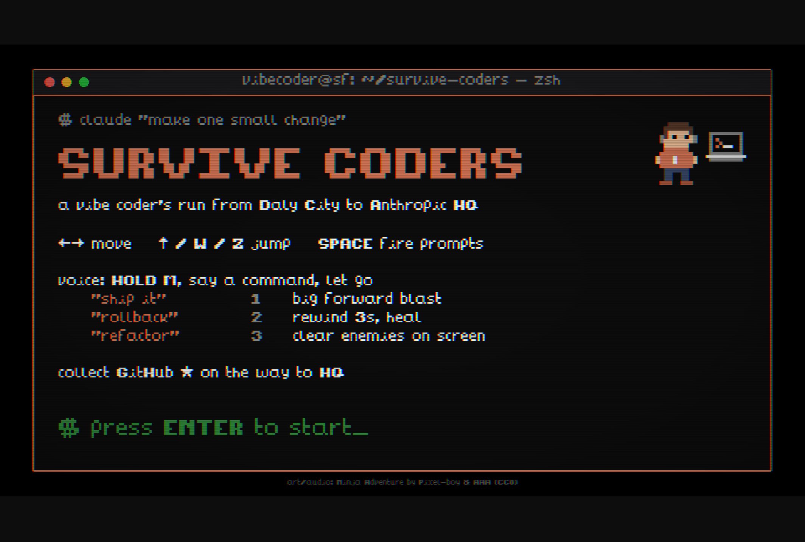 | 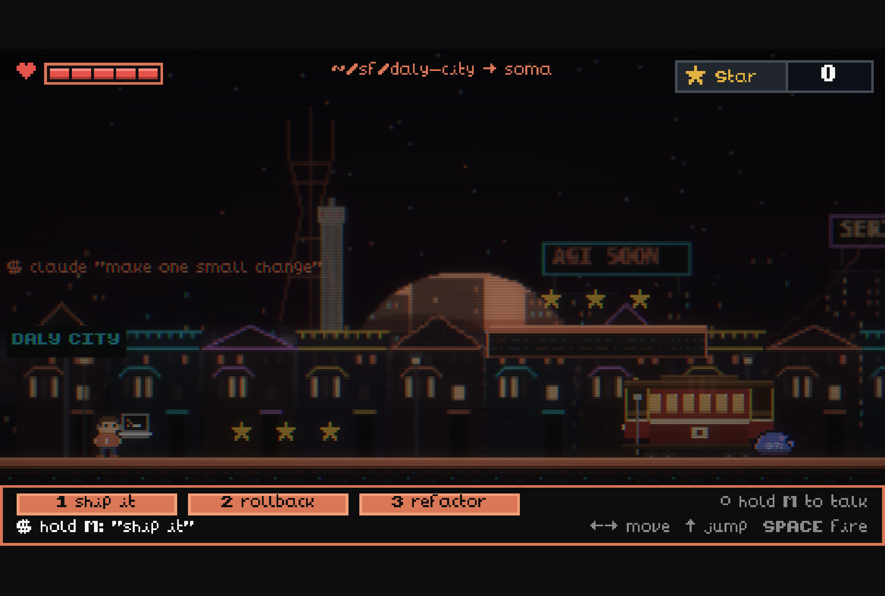 |
| 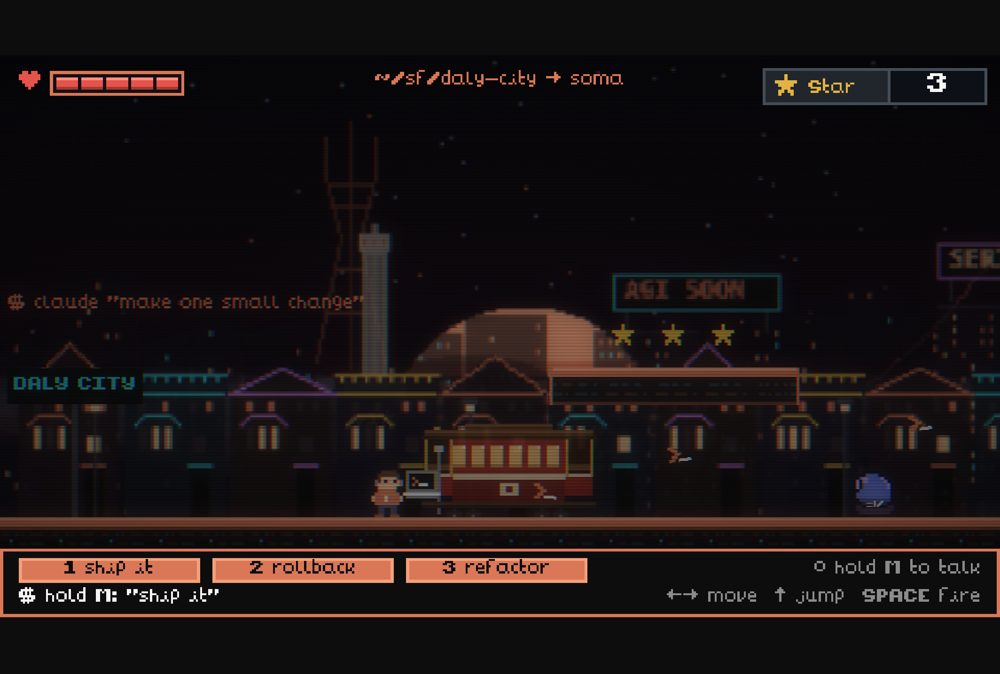 | 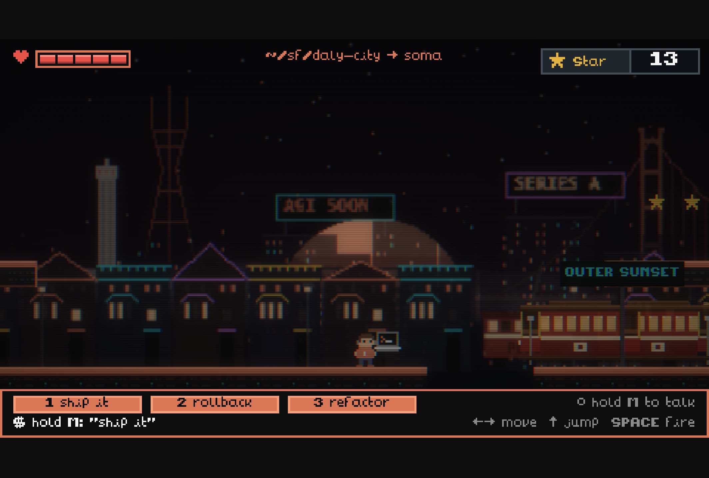 |
| 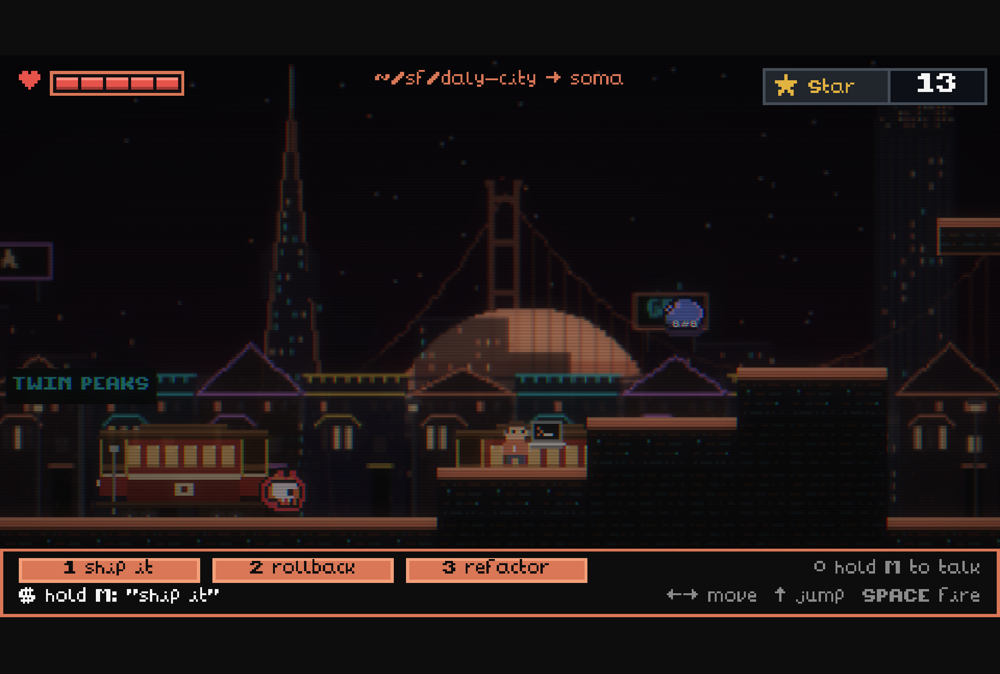 | 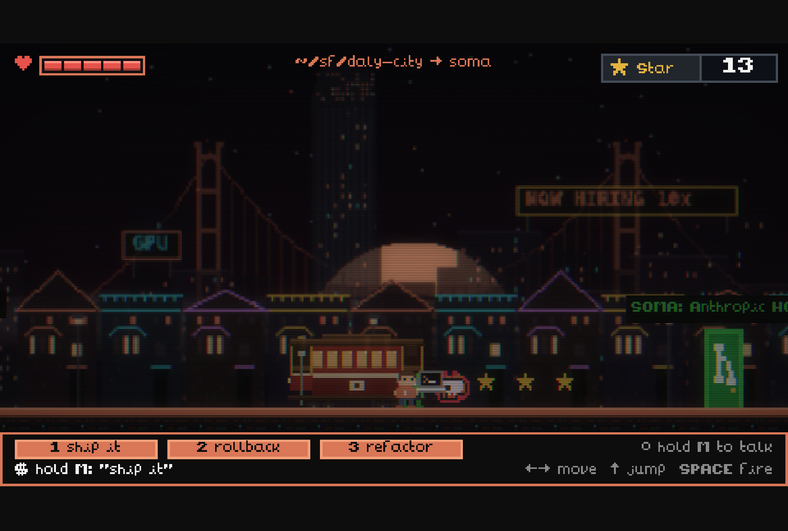 |
| 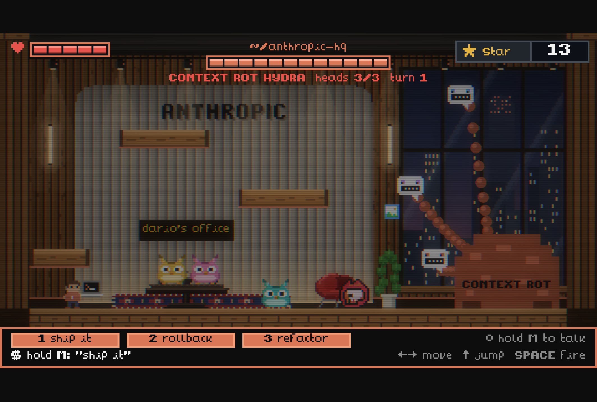 | 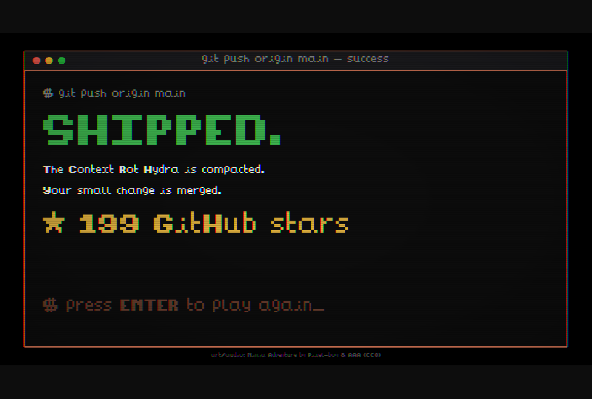 |
| 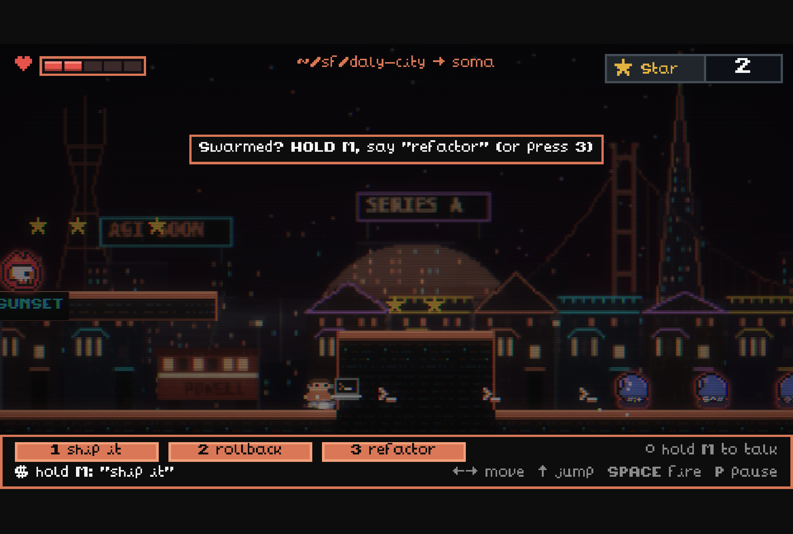 | 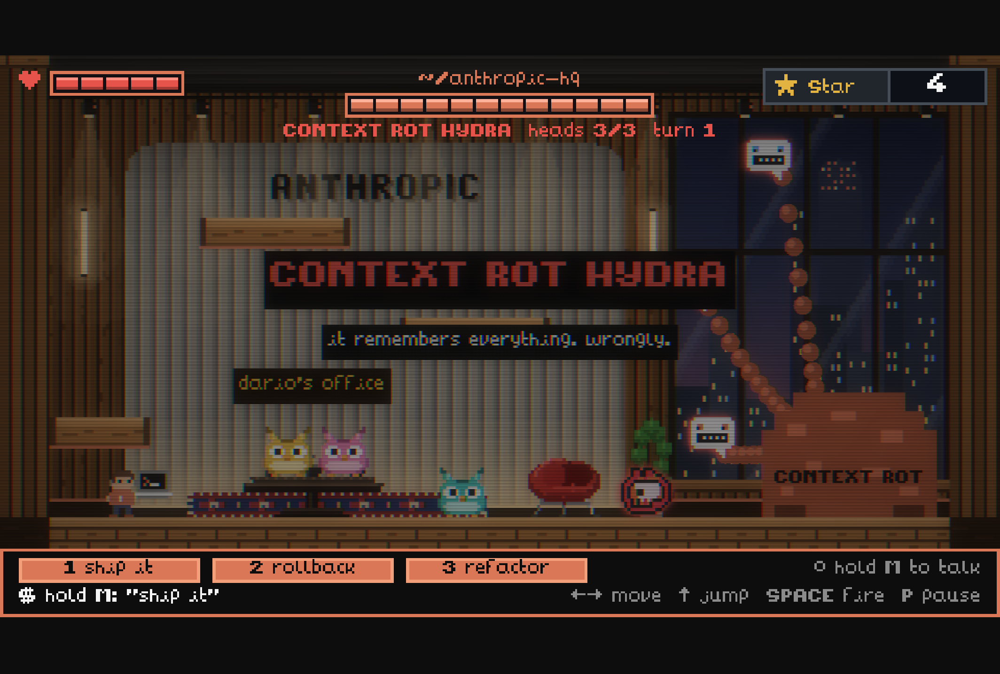 |
| 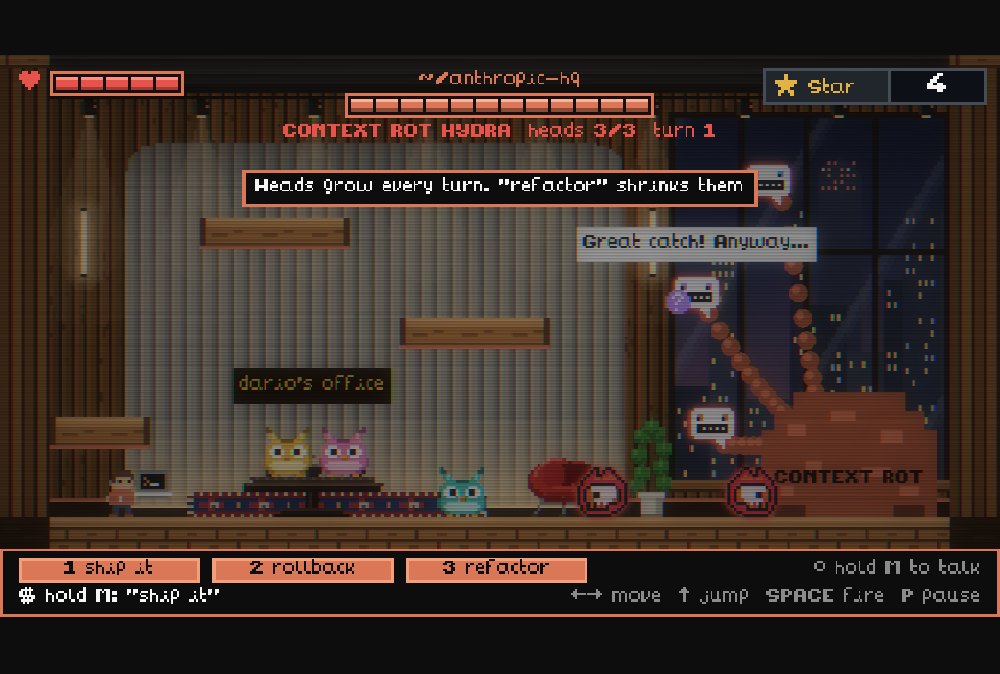 | |

## Backlog (not done, ranked)

1. **A head-bump corner correction of about 4px** (Celeste). Clipping a platform's corner currently stops the jump dead.
2. **Trauma-based screen shake** (Eiserloh): shake = trauma², using noise instead of random values, applied only to big events.
3. **Separate music and SFX volumes** (GAG basic). N currently mutes everything.
4. **A visible countdown to the next Hydra turn,** so the growth mechanic reads without the tip.
5. **A greyscale value check of the SF backdrop at gameplay height.** If it's still busy, darken only the band behind the street and keep the opacity ladder.
6. **One-way platforms,** so the player can jump up through shelves and slabs.
7. **Sign-in and a leaderboard** (deferred earlier).

## Astra handoff pass (2026-09-26)

Source: `feed/astrafeedback/HANDOFF-2026-09-26.md`, written against `fd9b850`, before the polish pass above.

| Item | Result | Verified |
|---|---|---|
| 1. Repeat runs can't exit | Reproduced: on run 2 the player walked past the door with `leaving` still true. Fixed by resetting per-run state in `create()`/`buildWorld()`, including the hit-stop latch and a physics world paused mid hit stop. | 3 consecutive runs reach HQ without a reload. |
| 2. Victory/defeat race | Reproduced: touching the Hydra's body during the collapse turned a win into a loss. Fixed with a single `outcome` per encounter: the first result wins, damage stops, hazards clear, and queued flood drops and attacks are cancelled. | The final head dies with the player at 1 HP against the body: exactly one `End {win:true}`. |
| 3. HQ retry | Already added in `7bd188d`. Now also resets cooldowns and the tip, and retries get a short intro (1.1s instead of 2.6s). | 3 boss retries: 1 music track, 1 voice listener, 1 pause listener, 3 heads, and stars restored to the checkpoint (a farmed 999 was discarded). |
| 4. Readable warnings | Each head has a role icon (image, ⇄, bell) that pulses during a 600ms wind-up. Flood lanes are chosen first and marked (drop icon + floor strip), then dropped exactly there, with 3 adjacent lanes always clear. Gaslight charges its orb, and the spawn head shows "new notification". Warnings are cleared on attack, head death, victory and retry. | Tiles landed on exactly the marked lanes (120px clear gap in the test). The charging orb was removed when the head died. See `14-after-flood-lanes.png`. |
| 5. Explain context growth | A HUD `CONTEXT` meter (one cell per growth step) with `next growth Ns` read from the real timer, and `FULL (refactor it!)` at max. Refactor shows `context compacted`, and the countdown keeps running because the schedule doesn't reset. The Title says refactor shrinks the Hydra. | The HUD countdown matched the timer (6s = 6s). Max growth reads FULL; after refactor, growth is 0 and the countdown continues at 5s. |
| God mode (Travis) | G on the title screen toggles it (remembered via localStorage), with a HUD `GOD MODE` badge. No damage; pits still respawn you. | Used for the retry and victory tests above. |

Not verified: real spoken commands (automation can't use the mic), audio mix, and difficulty with human players. HUD overlap at small window sizes isn't a concern because the canvas scales uniformly (FIT), so the HUD layout is resolution-independent.

## Astra next-improvements pass (2026-09-26)

| Item | Change | Verified |
|---|---|---|
| Voice feedback clarity | The HUD separates what was **heard** (left: `heard "…"`) from what **happened** (right, for 2s: `✓ ran: refactor` or `refactor: cooling down Ns`), and the slot of the power that ran flashes green. Mic setup is an explicit **V** on the title screen, so no permission prompt interrupts a run. Keys 1/2/3 always work. | Pressing 3 twice showed `✓ ran: refactor`, then `refactor: cooling down 10s`, then `○ hold M to talk`. |
| Staged boss entrance | First attempt: the office dims and the music is held, the terminal types `$ claude "make one small change"`, and each head answers in turn ("Sure! Rewriting the whole repo." / "You're absolutely right!" / "Also added 14 features ✓"). Then the title card and the music. Retries get the 1.1s card only. Random lies and growth pause during the intro. | The Hydra holds its attacks for about 6.5s. First attacks are staggered at 7.4/8.3/9.6s on the first attempt and from 2.8s on retries. |
| Neighborhood set piece | Powell St cable car: the third pit widens into a 176px gap. The car waits at the Twin Peaks station until someone lands on its roof, carries them across past a star trail, waits 1.5s, then returns. It has a warm outline; background trolleys are dimmed so the rideable one reads as foreground. The high platform stays as a skill route over the gap. | Riding carries the player at the car's speed. After a missed jump the car comes back. |

Bugs found while testing:
- **Scene clock stale in `create()`:** `this.time.now` updates only in the first update, so anything scheduled from it at create (intro hold, first attacks, blob hops) was already in the past. Fixed by syncing the clock in `buildWorld()`.
- **Synchronized first attacks:** the hold logic re-rolled attack times every frame and they converged. Fixed with a per-head stagger.
- **Softlock:** the pit respawn point could be saved on the moving car roof, which respawned you in mid-air over the gap. Respawn points now save only on ground tiles.
